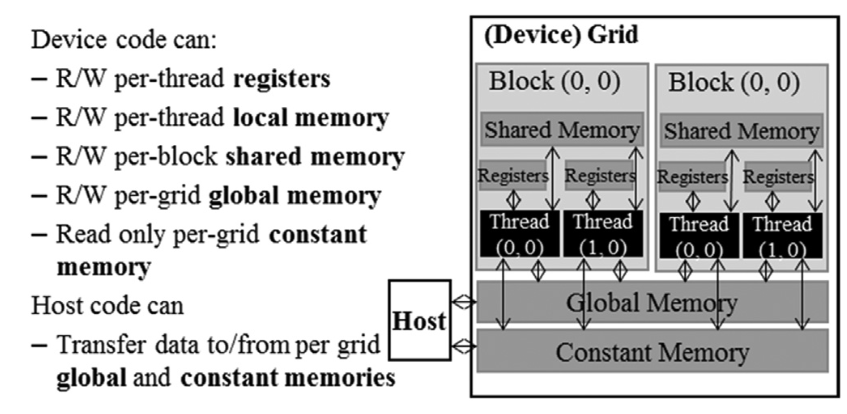
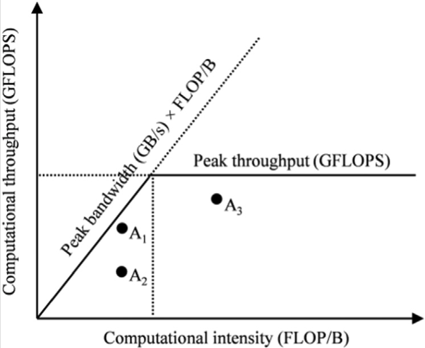

Efficient parallel programming on GPUs requires not just raw compute power, but careful attention to how data is stored and accessed. CUDA exposes multiple distinct memory types, each with unique properties. This blog introduces each CUDA memory type and explains the essential concept of the **compute-to-memory access ratio**, a key metric for GPU performance optimization.

---

## CUDA Memory Types

<figure>
  
  <figcaption>Figure 1: An overview of the CUDA device memory model.</figcaption>
</figure>

CUDA devices provide several types of memory, each serving different roles in executing massively parallel computations:

| Memory Type        | Location            | Scope     | Lifetime      | Access Speed    | Capacity        | Typical Use                                       |
|--------------------|---------------------|-----------|--------------|-----------------|-----------------|---------------------------------------------------|
| **Register**       | On-chip, per thread | Thread    | Kernel        | Fastest         | Few KB/thread   | Scalars, loop counters                             |
| **Local**          | Off-chip (DRAM)     | Thread    | Kernel        | Slow            | Large           | Large thread-private arrays, register spill        |
| **Shared**         | On-chip, per block  | Block     | Kernel        | Fast (on-chip)  | ~100 KB/SM      | Block-wide data sharing, frequent reuse            |
| **Global**         | Off-chip (DRAM)     | All       | Application   | Slow            | GBs             | Main data arrays                                   |
| **Constant**       | Off-chip + cached   | All       | Application   | Fast if cached  | 64 KB           | Invariants, kernel parameters (read-only to GPU)   |

### Register Memory

- **Scope:** Private to each thread  
- **Performance:** Fastest memory with extremely low latency and high bandwidth  
- **Limitation:** Limited quantity; excessive use reduces occupancy (number of simultaneous threads per SM)  
- **Usage:** Scalars and frequently accessed variables

### Local Memory

- **Scope:** Private to each thread  
- **Location:** Actually resides in slow global memory  
- **Usage:** Large per-thread arrays or register spillover  
- **Performance:** High latency, avoid for performance-critical variables

### Shared Memory

- **Scope:** Shared among threads in a block  
- **Location:** On-chip, configurable per block  
- **Performance:** Much faster than global memory, ideal for data reused across threads in a block  
- **Usage:** Cooperative loading/reuse (e.g., block-level tile in matrix multiply)

### Global Memory

- **Scope:** Accessible to all threads and host  
- **Location:** Large off-chip DRAM  
- **Performance:** High latency, limited bandwidth  
- **Usage:** Main storage for arrays and data structures

### Constant Memory

- **Scope:** All threads, read-only for device  
- **Location:** Cached on-chip  
- **Performance:** Fast if accesses are uniform (broadcast), small total size  
- **Usage:** Kernel parameters, constants, look-up tables

### Variable Lifetime and Declaration

CUDA uses type qualifiers to associate variables with memory types:
- `__device__` places data in global memory
- `__shared__` requests shared memory within a block
- `__constant__` allocates constant memory.
- Automatic (non-array) variables default to registers; automatic arrays go to local memory

---

## The Compute-to-Memory Access Ratio

### What Is It?

The **compute-to-memory access ratio** (also called *arithmetic intensity* or *computational intensity*) is the number of floating point operations (FLOPs) performed for every byte loaded from global memory:

$$
\text{Compute intensity } = \frac{\text{FLOPs}}{\text{Bytes accessed from global memory}}
$$

- Low ratio:  Kernel is **memory-bound**—performance limited by the rate at which data can be fetched from memory.
- High ratio: Kernel is **compute-bound**—performance limited by computational hardware, not data movement.

> [!example]-  Example
> A simple CUDA kernel for [matrix multiplication](matmul) with 2 FLOPs (multiply and add) per iteration, and 8 bytes (two floats) accessed per iteration, has a compute intensity of $ 0.25\, \text{FLOP/B} $.
> Let consider the configuration of a A100 Nvidia Card Bandwidth 1555 GB/s with ratio 0.25 FLOP/B:
> $$
> \text{Peak GFLOPS from memory} = 1555\, \text{GB/s} \times 0.25\, \text{FLOP/B} = 389\, \text{GFLOPS}
> $$
> This is far below the hardware peak (≈19,500 GFLOPS), so the kernel is memory-bound.

### The Roofline Model

<figure>
  
  <figcaption>Figure 2: Roofline model showing memory- vs compute-bound regions.</figcaption>
</figure>

The **roofline model** visually captures the interaction:
- **X-axis:** Arithmetic intensity (FLOP/B)
- **Y-axis:** Throughput (GFLOPS)
- Performance is capped by either the memory bandwidth “roof” or the compute "roof".  

Points close to the rooflines are efficient and points far below indicate wasted compute or bandwidth. In general, implementing kernel that have higher computational intensity/data reuse is key for better performance.

### How To Improve the Ratio

> [!tip] Optimization Checklist
> - **Maximize data reuse:** Use shared memory or registers to serve multiple computations with a single memory load.
> - **Reduce memory traffic:** Carefully coalesce accesses and avoid unnecessary loads/stores.
> - **Exploit locality:** Rearrange algorithms to reuse data in fast, on-chip memories.

---

## Summary

**CUDA programming performance** is tightly linked to memory system use:
- Use faster on-chip memories (registers/shared/constant) wherever possible
- Structure kernels for high compute-to-memory ratios
- Use metrics—and models like the roofline—to diagnose and bottleneck performance
- Optimize for both hardware and algorithmic efficiency for best results

---
## References
Hwu, W.-M. W., Kirk, D. B., & El Hajj, I. (2022). Programming massively parallel processors (4th ed.). doi:10.1016/c2020-0-02969-5
