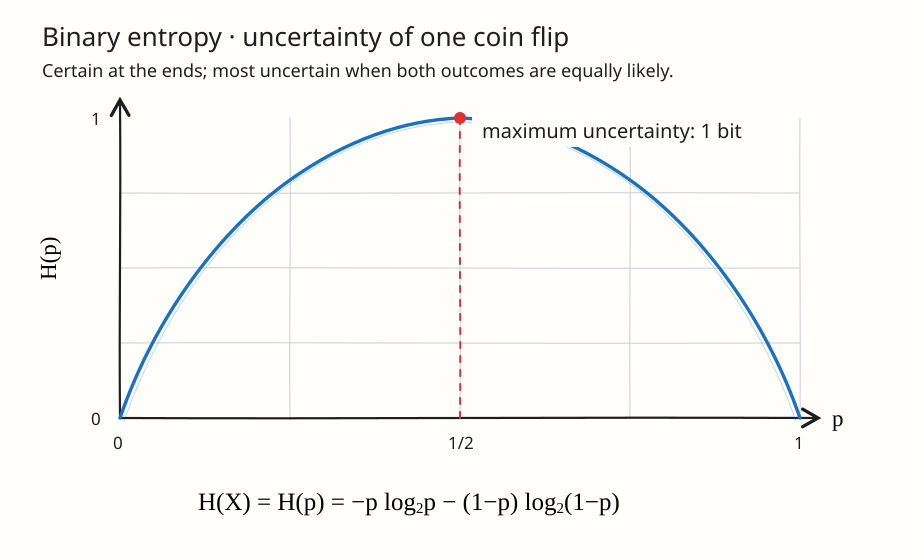
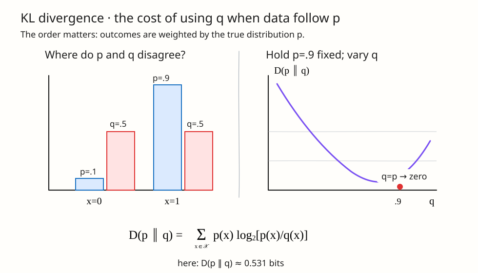
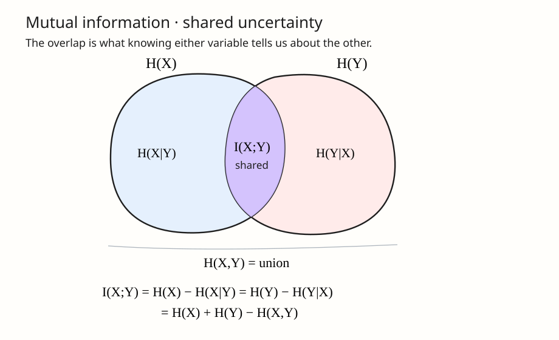

Information theory begins with a simple question: **how much uncertainty is contained in a random variable?** From that starting point, we can quantify how uncertainty changes when variables are observed, how different two probability distributions are, and how much information two variables share.

This note develops the core definitions and identities from Sections 2.1-2.5 of Cover and Thomas, using discrete random variables and base-2 logarithms throughout.

> [!note] Notation convention
> Uppercase letters such as $X$, $Y$, and $Z$ denote random variables. Lowercase letters such as $x$, $y$, and $z$ denote particular realized values. Calligraphic letters such as $\mathcal{X}$ denote alphabets, so $x\in\mathcal{X}$. We write $p_X(x)=\Pr(X=x)$, $p_{X,Y}(x,y)=\Pr(X=x,Y=y)$, and $p_{Y\mid X}(y\mid x)=\Pr(Y=y\mid X=x)$. When comparing two abstract distributions, we follow the book and use the shorter notation $p(x)$ and $q(x)$.

---

## 1. Entropy

Let $X$ be a discrete random variable with alphabet $\mathcal{X}$ and probability mass function $p_X(x)$. Before defining the average uncertainty of $X$, it helps to quantify the information associated with one outcome.

### 1.1 Surprise of an outcome

The **self-information** or surprise of observing $X=x$ is

$$
\imath_X(x) = \log_2 \frac{1}{p_X(x)} = -\log_2 p_X(x).
$$

This definition captures three useful intuitions:

1. A likely event is not very surprising.
2. A rare event carries more information.
3. Independent events should contribute additive information.

The third property explains the logarithm. If $X$ and $Y$ are independent, then the joint probability of observing $X=x$ and $Y=y$ is $p_X(x)p_Y(y)$, while the information in that joint outcome is

$$
\log_2\frac{1}{p_X(x)p_Y(y)}
= \log_2\frac{1}{p_X(x)} + \log_2\frac{1}{p_Y(y)}.
$$

Probability multiplies, but information adds.

### 1.2 Expected surprise

The **entropy** of $X$ is the expected surprise of its outcome:

$$
\boxed{
H(X)
= -\sum_{x\in\mathcal{X}}p_X(x)\log_2p_X(x)
= \mathbb{E}_{X\sim p_X}\left[\log_2\frac{1}{p_X(X)}\right]
}
$$

We use the convention $0\log 0=0$. Entropy depends only on the probabilities, not on the labels assigned to the outcomes.

Because $0\leq p_X(x)\leq 1$, every term $\log_2(1/p_X(x))$ is nonnegative, so

$$
H(X)\geq 0.
$$

If the logarithm uses base $2$, entropy is measured in **bits**. Natural logarithms give **nats**. See the [[notation|notation reference]] for the probability notation used throughout this note.

### 1.3 Bernoulli entropy

For $X\sim\operatorname{Bernoulli}(p)$,

$$
H(X)=H(p)
=-p\log_2p-(1-p)\log_2(1-p),
$$

where $H(p)$ denotes the entropy of a Bernoulli random variable with parameter $p$.

- If $p=0$ or $p=1$, then $X$ is deterministic and $H(X)=0$.
- If $p=1/2$, both outcomes are equally likely and $H(X)=1$ bit.

_Figure 1: The binary entropy is symmetric around $p=1/2$, where uncertainty is maximized._

Entropy therefore measures uncertainty rather than the numerical size of an outcome.

> [!example]- Unequal probabilities
> Suppose $X$ has four possible outcomes with probabilities
>
> $$
> \left(\frac12,\frac14,\frac18,\frac18\right).
> $$
>
> Then
>
> $$
> H(X)
> =\frac12(1)+\frac14(2)+\frac18(3)+\frac18(3)
> =\frac74\text{ bits}.
> $$
>
> The terms $1$, $2$, and $3$ are the surprises of outcomes having probabilities $1/2$, $1/4$, and $1/8$.

### 1.4 Entropy as description length

Entropy is closely connected to compression. If outcomes are encoded efficiently, common outcomes receive short binary descriptions and rare outcomes receive longer descriptions. The entropy is the fundamental target for the average number of bits required to describe the outcome.

---

## 2. Joint Entropy and Conditional Entropy

Entropy extends naturally from one random variable to several. For background on joint and conditional distributions, see [[join_prob|Joint Probability Distributions]].

### 2.1 Joint entropy

The pair $(X,Y)$ can be treated as one vector-valued random variable. Its **joint entropy** is

$$
\boxed{
H(X,Y)=-\sum_{x\in\mathcal{X}}\sum_{y\in\mathcal{Y}}p_{X,Y}(x,y)\log_2p_{X,Y}(x,y)
}
$$

Joint entropy measures how much uncertainty is present in the pair before either variable is observed.

### 2.2 Conditional entropy

After observing $X=x$, our remaining uncertainty about $Y$ is

$$
H(Y\mid X=x)
=-\sum_{y\in\mathcal{Y}} p_{Y\mid X}(y\mid x)\log_2p_{Y\mid X}(y\mid x).
$$

The **conditional entropy** averages this quantity over $X$:

$$
\boxed{
H(Y\mid X)
=\sum_{x\in\mathcal{X}}p_X(x)H(Y\mid X=x)
=-\sum_{x\in\mathcal{X}}\sum_{y\in\mathcal{Y}}p_{X,Y}(x,y)\log_2p_{Y\mid X}(y\mid x)
}
$$

The distinction is important:

- $H(Y\mid X=x)$ is the uncertainty after one particular observation.
- $H(Y\mid X)$ is the remaining uncertainty averaged over all possible observations of $X$.

### 2.3 The two-variable entropy chain rule

Using the probability factorization

$$
p_{X,Y}(x,y)=p_X(x)p_{Y\mid X}(y\mid x),
$$

we obtain

$$
\begin{aligned}
H(X,Y)
&=-\sum_{x,y}p_{X,Y}(x,y)\log_2\bigl(p_X(x)p_{Y\mid X}(y\mid x)\bigr)\\
&=-\sum_{x,y}p_{X,Y}(x,y)\log_2p_X(x)
  -\sum_{x,y}p_{X,Y}(x,y)\log_2p_{Y\mid X}(y\mid x)\\
&=H(X)+H(Y\mid X).
\end{aligned}
$$

Therefore,

$$
\boxed{H(X,Y)=H(X)+H(Y\mid X)}.
$$

The interpretation is sequential: first describe $X$, then describe what remains unknown about $Y$ once $X$ is available.

Reversing the order gives

$$
H(X,Y)=H(Y)+H(X\mid Y).
$$

In general, $H(Y\mid X)$ and $H(X\mid Y)$ are not equal. What is equal is the total joint uncertainty obtained after adding the appropriate marginal entropy.

> [!note]- Main properties of joint and conditional entropy
> These properties hold for discrete random variables.
>
> **Joint entropy**
>
> 1. **Symmetry**
>    $$
>    H(X,Y)=H(Y,X).
>    $$
>
> 2. **Chain rule**
>    $$
>    H(X,Y)=H(X)+H(Y\mid X)=H(Y)+H(X\mid Y).
>    $$
>
> 3. **Bounds**
>    $$
>    \max\{H(X),H(Y)\}
>    \leq H(X,Y)
>    \leq H(X)+H(Y).
>    $$
>    The upper bound is attained if and only if $X$ and $Y$ are independent.
>
> 4. **Repeating a variable adds no uncertainty**
>    $$
>    H(X,X)=H(X).
>    $$
>
> **Conditional entropy**
>
> 1. **Average remaining uncertainty**
>    $$
>    H(X\mid Y)
>    =\sum_{y\in\mathcal{Y}}p_Y(y)H(X\mid Y=y).
>    $$
>
> 2. **Nonnegativity**
>    $$
>    H(X\mid Y)\geq0.
>    $$
>
> 3. **Conditioning reduces entropy on average**
>    $$
>    H(X\mid Y)\leq H(X),
>    $$
>    with equality if and only if $X$ and $Y$ are independent. A proof appears in [[information-inequalities-data-processing-fano#133-conditioning-reduces-entropy-on-average|the inequalities note]].
>
> 4. **Zero conditional entropy**
>    $$
>    H(X\mid Y)=0
>    $$
>    if and only if $X$ is determined by $Y$ with probability one.
>
> Conditional entropy is generally not symmetric: $H(X\mid Y)$ need not equal $H(Y\mid X)$.

---

## 3. Relative Entropy (KL Divergence)

Entropy describes uncertainty within one distribution. Relative entropy instead compares two distributions over the same alphabet $\mathcal{X}$:

- $p$ is the distribution that actually generates the outcomes.
- $q$ is the distribution used by our model, approximation, or code.

The question is: **how costly is it to use $q$ when the data really follow $p$?**

### 3.1 From the likelihood ratio to KL divergence

For one realized outcome $x$, compare the probability assigned by the two distributions through the log-likelihood ratio

$$
\log_2\frac{p(x)}{q(x)}.
$$

This quantity is positive when $p(x)>q(x)$ and negative when $p(x)<q(x)$. However it is not a true distance between distributions since it is not symmetric and does not satisfy the triangle inequality. Nonetheless, it is often useful to think of relative entropy as a “distance” between distributions. Because outcomes are generated according to $p$, we average the log-likelihood ratio under $p$:

$$
\boxed{
D(p\parallel q)
=\sum_{x\in\mathcal{X}}p(x)\log_2\frac{p(x)}{q(x)}
=\mathbb{E}_{X\sim p}\left[\log_2\frac{p(X)}{q(X)}\right]
}
$$

This expectation is the **relative entropy** or **Kullback-Leibler divergence** of $p$ relative to $q$. With base-2 logarithms, it is measured in bits.

> [!note] The order has meaning
> In $D(p\parallel q)$, samples come from $p$, so $p$ determines how each log-ratio is weighted. Reversing the arguments changes both the ratios and the averaging distribution. The symbol $\parallel$ is deliberately directional.

### 3.2 Coding interpretation: the cost of the wrong model

If we know the true distribution $p$, the ideal description length assigned to outcome $x$ is

$$
\ell_p(x)=-\log_2p(x).
$$

If we instead construct the code using $q$, the same outcome receives length

$$
\ell_q(x)=-\log_2q(x).
$$

Since outcomes still occur according to $p$, the average length of the code based on $q$ is the **cross-entropy**

$$
H_{\mathrm{cross}}(p,q)
=-\sum_xp(x)\log_2q(x).
$$

Adding and subtracting $\log_2p(x)$ gives

$$
\begin{aligned}
H_{\mathrm{cross}}(p,q)
&=-\sum_xp(x)\log_2p(x)
  +\sum_xp(x)\log_2\frac{p(x)}{q(x)}\\
&=H(p)+D(p\parallel q).
\end{aligned}
$$

Here $H(p)=-\sum_xp(x)\log_2p(x)$ is the entropy of the distribution $p$. Therefore,

$$
\boxed{
D(p\parallel q)
=H_{\mathrm{cross}}(p,q)-H(p)
}
$$

KL divergence is the extra average description length caused by using $q$ instead of the true distribution $p$. If $q=p$, there is no mismatch and the extra cost is zero.

> [!note]- Connection to cross-entropy loss
> The same decomposition explains the cross-entropy loss used to train classifiers. Let $X$ be an input random variable and let $Y$ be its class-label random variable with alphabet $\mathcal{Y}=\{1,\ldots,K\}$. Suppose
>
> - $p_{\mathrm{data}}(x,y)$ is the true joint data distribution,
> - $p_{\mathrm{data}}(y\mid x)$ is its conditional label distribution, and
> - $q_\theta(y\mid x)$ is the distribution predicted by a model with parameters $\theta$.
>
> For a fixed input realization $x$, the population cross-entropy is
>
> $$
> H_{\mathrm{cross}}\!\left(
> p_{\mathrm{data}}(\cdot\mid x),
> q_\theta(\cdot\mid x)
> \right)
> =-\sum_{y=1}^{K}p_{\mathrm{data}}(y\mid x)\log_2 q_\theta(y\mid x).
> $$
>
> Averaging over inputs and applying the KL decomposition gives
>
> $$
> \begin{aligned}
> \sum_{x\in\mathcal{X}}p_{\mathrm{data}}(x)
> H_{\mathrm{cross}}\!\left(
> p_{\mathrm{data}}(\cdot\mid x),
> q_\theta(\cdot\mid x)
> \right)
> &=H(Y\mid X)\\
> &\quad+\sum_{x\in\mathcal{X}}p_{\mathrm{data}}(x)
> D\!\left(
> p_{\mathrm{data}}(\cdot\mid x)
> \parallel
> q_\theta(\cdot\mid x)
> \right).
> \end{aligned}
> $$
>
> The conditional entropy $H(Y\mid X)$ is determined by the data-generating distribution and does not depend on $\theta$. Therefore, minimizing cross-entropy with respect to $\theta$ is equivalent to minimizing the expected KL divergence from the true conditional distribution to the model distribution.
>
> In a labeled dataset, we observe one class realization $y$ for each input realization $x$. Its one-hot target is $t_k=\mathbf{1}\{y=k\}$. Machine-learning libraries normally use natural logarithms, so the per-example loss becomes
>
> $$
> \begin{aligned}
> \mathcal{L}_{\mathrm{CE}}(x,y;\theta)
> &=-\sum_{k=1}^{K}t_k\ln q_\theta(Y=k\mid X=x)\\
> &=-\ln q_\theta(Y=y\mid X=x).
> \end{aligned}
> $$
>
> For binary classification, with $\mathcal{Y}=\{0,1\}$ and $\hat{p}_\theta(x)=q_\theta(Y=1\mid X=x)$, this reduces to binary cross-entropy:
>
> $$
> \mathcal{L}_{\mathrm{BCE}}(x,y;\theta)
> =-y\ln\hat{p}_\theta(x)
> -(1-y)\ln\bigl(1-\hat{p}_\theta(x)\bigr).
> $$
>
> These empirical losses are measured in nats rather than bits. Changing the log base only rescales the objective by a positive constant and does not change its minimizer.

> [!note]- Worked example: Bernoulli distributions
>
> Let $p$ and $q$ be Bernoulli PMFs with $p(1)=0.9$ and $q(1)=0.5$, where the realization $x=1$ denotes success.
>
> 
>
> <em>Figure 2: The bars show where $p$ and $q$ disagree. The curve shows the resulting $D(p\parallel q)$: it reaches zero only when the model matches the true distribution, $q=p$, and grows as the mismatch increases.</em>
>
> | $x$ | $p(x)$ | $q(x)$ |  $\log_2\frac{p(x)}{q(x)}$ | Contribution to $D(p\parallel q)$ |
> | --: | -----: | -----: | -------------------------: | --------------------------------: |
> | $1$ |  $0.9$ |  $0.5$ |  $\log_2(1.8)\approx0.848$ |          $0.9(0.848)\approx0.763$ |
> | $0$ |  $0.1$ |  $0.5$ | $\log_2(0.2)\approx-2.322$ |        $0.1(-2.322)\approx-0.232$ |
>
> Summing the two weighted contributions,
>
> $$
> D(p\parallel q)
> \approx0.763-0.232
> =0.531\text{ bits}.
> $$
>
> One outcome contributes a negative value, but the average is nonnegative. If we reverse the arguments,
>
> $$
> D(q\parallel p)\approx0.737\text{ bits},
> $$
>
> because the expectation is now taken under $q$. The two directions describe different modeling mistakes.

### 3.3 Conditional relative entropy

For joint PMFs $p(x,y)$ and $q(x,y)$, the **conditional relative entropy** between $p(y\mid x)$ and $q(y\mid x)$, averaged over $p(x)$, is

$$
\boxed{
\begin{aligned}
D\bigl(p(y\mid x)\parallel q(y\mid x)\bigr)
&:=\sum_{x\in\mathcal{X}}p(x)
\sum_{y\in\mathcal{Y}}p(y\mid x)
\log_2\frac{p(y\mid x)}{q(y\mid x)}\\
&=\mathbb{E}_{(X,Y)\sim p}
\left[\log_2\frac{p(Y\mid X)}{q(Y\mid X)}\right].
\end{aligned}
}
$$

The notation does not explicitly mention the averaging distribution $p(x)$; as in the book, it is understood from context.

### 3.4 What KL divergence does and does not guarantee

KL divergence satisfies

$$
D(p\parallel q)\geq0,
$$

with equality if and only if $p(x)=q(x)$ for every $x\in\mathcal{X}$. This nonnegativity is not obvious from the individual terms, as the example above shows; it is a property of their expectation.

> [!note]- Proof: KL divergence is nonnegative
> Let $S=\{x\in\mathcal{X}:p(x)>0\}$. If $q(x)=0$ for any $x\in S$, then $D(p\parallel q)=\infty$, so the claim holds immediately. Otherwise, $q(x)/p(x)>0$ for every $x\in S$.
>
> The elementary inequality
>
> $$
> \ln u\leq u-1,\qquad u>0,
> $$
>
> gives
>
> $$
> \begin{aligned}
> -(\ln 2)D(p\parallel q)
> &=\sum_{x\in S}p(x)\ln\frac{q(x)}{p(x)}\\
> &\leq\sum_{x\in S}p(x)
> \left(\frac{q(x)}{p(x)}-1\right)\\
> &=\sum_{x\in S}q(x)-\sum_{x\in S}p(x)\\
> &=1-1 =0\\
>
> \end{aligned}
> $$
>
> Since $\ln 2>0$, this implies
>
> $$
> D(p\parallel q)\geq0.
> $$
>
> Equality in $\ln u\leq u-1$ occurs only at $u=1$. Therefore equality requires $q(x)/p(x)=1$ for every $x\in S$. Normalization then leaves no probability mass for $q$ outside $S$, so $q(x)=p(x)$ for every $x\in\mathcal{X}$. Hence
>
> $$
> D(p\parallel q)=0\quad\Longleftrightarrow\quad p=q.
> $$

If some outcome satisfies $p(x)>0$ but $q(x)=0$, then

$$
D(p\parallel q)=\infty.
$$

The model declares an outcome impossible even though it can occur under the data-generating distribution, producing an infinite log-loss.

Finally, KL divergence is not a geometric distance. In general,

$$
D(p\parallel q)
\neq D(q\parallel p),
$$

and KL divergence does not satisfy the triangle inequality.

This expected log-ratio viewpoint connects directly to [[MLE|maximum likelihood estimation]] and appears as a regularization term in [[VAE|variational autoencoders]].

---

## 4. Mutual Information

Entropy measures uncertainty in one distribution, while KL divergence compares two distributions. **Mutual information** uses KL divergence to measure dependence between two variables:

$$
\boxed{
I(X;Y)
=D\bigl(p_{X,Y}\parallel p_Xp_Y\bigr)
}
$$

Expanding the definition,

$$
I(X;Y)
=\sum_{x\in\mathcal{X}}\sum_{y\in\mathcal{Y}}p_{X,Y}(x,y)
\log_2\frac{p_{X,Y}(x,y)}{p_X(x)p_Y(y)}.
$$

The product $p_X(x)p_Y(y)$ is the joint probability mass function we would have if $X$ and $Y$ were independent. Mutual information therefore quantifies how distinguishable the actual joint distribution is from an independent one.

- If $X$ and $Y$ are independent, $p_{X,Y}(x,y)=p_X(x)p_Y(y)$ and $I(X;Y)=0$.
- If knowing $Y$ reduces uncertainty about $X$, then $I(X;Y)>0$.

### 4.1 Mutual information as uncertainty reduction

Since $p_{X,Y}(x,y)=p_{X\mid Y}(x\mid y)p_Y(y)$,

$$
\begin{aligned}
I(X;Y)
&=\sum_{x,y}p_{X,Y}(x,y)\log_2\frac{p_{X\mid Y}(x\mid y)}{p_X(x)}\\
&=H(X)-H(X\mid Y).
\end{aligned}
$$

By symmetry,

$$
I(X;Y)=H(Y)-H(Y\mid X).
$$

Combining these expressions with the entropy chain rule gives the fundamental identities

$$
\boxed{
\begin{aligned}
I(X;Y)
&=H(X)-H(X\mid Y)\\
&=H(Y)-H(Y\mid X)\\
&=H(X)+H(Y)-H(X,Y).
\end{aligned}
}
$$

_Figure 3: A mnemonic for the relationships among marginal entropy, conditional entropy, joint entropy, and mutual information._

Consequently,

$$
I(X;Y)=I(Y;X),
$$

and a variable contains all of its own uncertainty:

$$
I(X;X)=H(X).
$$

The venn diagram is a useful illustration: $I(X;Y)$ is drawn as the overlap between $H(X)$ and $H(Y)$, while $H(X\mid Y)$ and $H(Y\mid X)$ are the non-overlapping parts. The algebraic identities above are the actual definitions; the diagram should not replace them.

> [!note]- Main properties of mutual information
> For discrete random variables $X$ and $Y$,
>
> 1. **Equivalent entropy forms**
>    $$
>    I(X;Y)
>    =H(X)-H(X\mid Y)
>    =H(Y)-H(Y\mid X)
>    =H(X)+H(Y)-H(X,Y).
>    $$
>
> 2. **Symmetry**
>    $$
>    I(X;Y)=I(Y;X).
>    $$
>
> 3. **Nonnegativity and independence**
>    $$
>    I(X;Y)\geq 0,
>    $$
>    with equality if and only if $X$ and $Y$ are independent.
>
> 4. **Entropy bound**
>    $$
>    I(X;Y)\leq \min\{H(X),H(Y)\}.
>    $$
>    Thus, two variables cannot share more information than either variable contains.
>
>    **Proof.** Since discrete conditional entropy is nonnegative,
>
>    $$
>    H(X\mid Y)\geq0.
>    $$
>
>    Therefore,
>
>    $$
>    I(X;Y)=H(X)-H(X\mid Y)\leq H(X).
>    $$
>
>    By symmetry,
>
>    $$
>    I(X;Y)=H(Y)-H(Y\mid X)\leq H(Y).
>    $$
>
>    Combining the two inequalities proves the bound. Equality with $H(X)$ holds exactly when $H(X\mid Y)=0$, so $X$ is determined by $Y$ with probability one; the analogous condition holds for equality with $H(Y)$. This argument is for discrete entropy, since conditional differential entropy need not be nonnegative.
>
> 5. **Self-information**
>    $$
>    I(X;X)=H(X).
>    $$

### 4.2 Conditional mutual information

The **conditional mutual information** between $X$ and $Y$ given $Z$ is

$$
\boxed{
\begin{aligned}
I(X;Y\mid Z)
&=H(X\mid Z)-H(X\mid Y,Z)\\
&=\mathbb{E}_{(X,Y,Z)\sim p_{X,Y,Z}}
\left[
\log_2\frac{p_{X,Y\mid Z}(X,Y\mid Z)}
{p_{X\mid Z}(X\mid Z)p_{Y\mid Z}(Y\mid Z)}
\right].
\end{aligned}
}
$$

It measures how much observing $Y$ reduces uncertainty about $X$ when $Z$ is already known. In the expectation, uppercase $X$, $Y$, and $Z$ are random variables drawn jointly according to $p_{X,Y,Z}$.

---

## 5. Chain Rules

Chain rules turn one complicated information quantity into a sequence of simpler contributions. The guiding question is:

> If the variables are revealed one at a time, how much new uncertainty, information, or model mismatch appears at each step?

No independence assumption is required. Following Section 2.5 of Cover and Thomas, each rule below uses conditioning to avoid counting information that earlier variables have already explained.

### 5.1 Chain rule for entropy

Suppose we want to describe the entire tuple $(X_1,\ldots,X_n)$. We can describe $X_1$ first, then describe only the part of $X_2$ that remains uncertain after $X_1$ is known, and continue in this way. This gives

$$
\boxed{
H(X_1,\ldots,X_n)
=H(X_1)+\sum_{i=2}^{n}H(X_i\mid X_1,\ldots,X_{i-1})
}
$$

The first term is written separately because nothing has been revealed before $X_1$. Every later term is conditional on all earlier variables.

For three variables, the rule reads

$$
\underbrace{H(X_1,X_2,X_3)}_{\text{uncertainty in the whole tuple}}
=\underbrace{H(X_1)}_{\text{describe }X_1}
+\underbrace{H(X_2\mid X_1)}_{\text{then describe }X_2}
+\underbrace{H(X_3\mid X_1,X_2)}_{\text{then describe }X_3}.
$$

Why does this work? The joint PMF has the probability chain rule

$$
p_{X_1,\ldots,X_n}(x_1,\ldots,x_n)
=p_{X_1}(x_1)
\prod_{i=2}^{n}p_{X_i\mid X_1,\ldots,X_{i-1}}(x_i\mid x_1,\ldots,x_{i-1}).
$$

Entropy averages the negative logarithm of this probability. The logarithm converts the product into a sum, so the probability factorization becomes an entropy decomposition.

The variables may be revealed in any order. The total joint entropy stays the same, although the individual conditional terms generally change with the order.

### 5.2 Chain rule for conditional entropy

Now suppose some side information $Z$ is available before either $X$ or $Y$ is revealed. We first measure the uncertainty left in $X$ given $Z$, and then the uncertainty left in $Y$ after both $Z$ and $X$ are known:

$$
\boxed{
H(X,Y\mid Z)
=H(X\mid Z)+H(Y\mid X,Z)
}.
$$

The identity can be checked by expressing conditional entropy as a difference of joint entropies:

$$
\begin{aligned}
H(X,Y\mid Z)
&=H(X,Y,Z)-H(Z)\\
&=H(X,Z)+H(Y\mid X,Z)-H(Z)\\
&=H(X\mid Z)+H(Y\mid X,Z).
\end{aligned}
$$

For a longer sequence, keep $Z$ in the conditioning set at every step:

$$
\boxed{
H(X_1,\ldots,X_n\mid Z)
=H(X_1\mid Z)
+\sum_{i=2}^{n}
H(X_i\mid X_1,\ldots,X_{i-1},Z)
}.
$$

The important point is that $Z$ is known throughout the entire process. The conditioning set grows from $Z$ to $(X_1,Z)$, then to $(X_1,X_2,Z)$, and so on. We are not repeatedly learning $Z$; it is background information available from the beginning.

### 5.3 Chain rule for mutual information

Suppose several variables $(X_1,\ldots,X_n)$ jointly tell us something about $Y$. The mutual-information chain rule attributes that information one variable at a time:

$$
\boxed{
I(X_1,\ldots,X_n;Y)
=I(X_1;Y)+\sum_{i=2}^{n}I(X_i;Y\mid X_1,\ldots,X_{i-1})
}
$$

For two variables,

$$
I(X_1,X_2;Y)
=I(X_1;Y)+I(X_2;Y\mid X_1).
$$

The first term measures what $X_1$ tells us about $Y$. The second does **not** count all information in $X_2$ again; it counts only what $X_2$ adds after $X_1$ is already known.

To see the decomposition algebraically, insert and subtract $H(Y\mid X_1)$:

$$
\begin{aligned}
I(X_1,X_2;Y)
&=H(Y)-H(Y\mid X_1,X_2)\\
&=\bigl[H(Y)-H(Y\mid X_1)\bigr]
+\bigl[H(Y\mid X_1)-H(Y\mid X_1,X_2)\bigr]\\
&=I(X_1;Y)+I(X_2;Y\mid X_1).
\end{aligned}
$$

Repeating the same step yields the $n$-variable formula. As with entropy, the individual contributions depend on the order of the $X_i$, but their sum is always the total information $I(X_1,\ldots,X_n;Y)$.

### 5.4 Chain rule for relative entropy

Here we compare two joint models, $p(x,y)$ and $q(x,y)$. Their total mismatch has two sources:

1. The models may assign different probabilities to $X$.
2. Even after the same value of $X$ is given, their conditional models for $Y$ may disagree.

Factor both joint PMFs into these two stages:

$$
p(x,y)=p(x)p(y\mid x),
\qquad
q(x,y)=q(x)q(y\mid x).
$$

Substituting the factorizations into the log-ratio separates the two sources of mismatch:

$$
\begin{aligned}
D\bigl(p(x,y)\parallel q(x,y)\bigr)
&=\sum_{x,y}p(x,y)
\log_2\frac{p(x)p(y\mid x)}{q(x)q(y\mid x)}\\
&=\sum_{x,y}p(x,y)\log_2\frac{p(x)}{q(x)}
+\sum_{x,y}p(x,y)\log_2\frac{p(y\mid x)}{q(y\mid x)}.
\end{aligned}
$$

Therefore,

$$
\boxed{
D\bigl(p(x,y)\parallel q(x,y)\bigr)
=D\bigl(p(x)\parallel q(x)\bigr)
+D\bigl(p(y\mid x)\parallel q(y\mid x)\bigr)
}
$$

The first term measures disagreement about the marginal distribution of $X$. The second is the conditional relative entropy

$$
D\bigl(p(y\mid x)\parallel q(y\mid x)\bigr)
=\sum_x p(x)
D\bigl(p(\cdot\mid x)\parallel q(\cdot\mid x)\bigr),
$$

so it averages the conditional mismatch over $x\sim p(x)$. In other words: first pay for using the wrong model of $X$; then, for each observed $X=x$, pay the average additional cost of using the wrong conditional model of $Y$.

---

## 6. Summary

| Quantity            | Definition                                                     | Interpretation                                         |
| ------------------- | -------------------------------------------------------------- | ------------------------------------------------------ |
| Entropy             | $H(X)=-\sum_xp_X(x)\log_2p_X(x)$                               | Uncertainty in $X$                                     |
| Joint entropy       | $H(X,Y)=-\sum_{x,y}p_{X,Y}(x,y)\log_2p_{X,Y}(x,y)$             | Uncertainty in the pair $(X,Y)$                        |
| Conditional entropy | $H(Y\mid X)=-\sum_{x,y}p_{X,Y}(x,y)\log_2p_{Y\mid X}(y\mid x)$ | Uncertainty left in $Y$ after observing $X$            |
| KL divergence       | $D(p\parallel q)=\sum_xp(x)\log_2\frac{p(x)}{q(x)}$            | Penalty for using $q$ when reality follows $p$         |
| Mutual information  | $I(X;Y)=D(p_{X,Y}\parallel p_Xp_Y)$                            | Dependence, or shared information, between $X$ and $Y$ |

The most important identities are

$$
H(X,Y)=H(X)+H(Y\mid X),
$$

$$
I(X;Y)=H(X)-H(X\mid Y)=H(Y)-H(Y\mid X),
$$

and

$$
I(X;Y)=H(X)+H(Y)-H(X,Y).
$$

Together, these definitions provide the basic language used throughout information theory, coding, statistics, and machine learning.

In the next blog I will continue with very important [[information-inequalities-data-processing-fano|Information Inequalities, Data Processing, and Fano's Inequality]], including Jensen's inequality, the log-sum inequality, sufficient statistics, and limits on estimation error.

---

## Reference

Thomas M. Cover and Joy A. Thomas. _Elements of Information Theory_, 2nd ed., Sections 2.1-2.5. Wiley, 2006.
