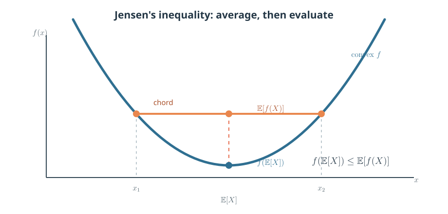
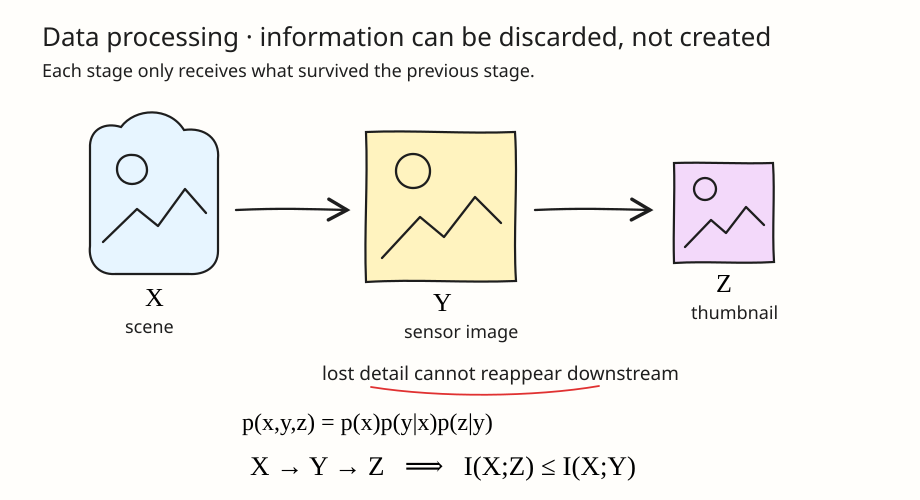
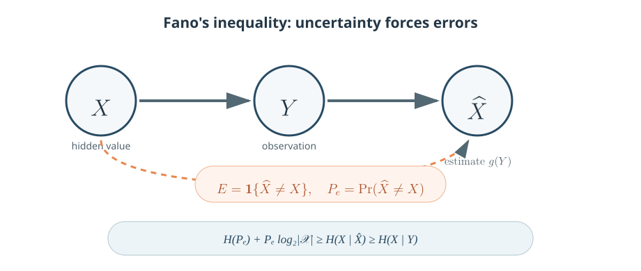

The definitions of entropy, relative entropy, and mutual information become useful when they produce limits that hold for every probability model. This note develops the main inequalities. It continues [[entropy-relative-entropy-mutual-information|Entropy and Mutual Information]].

We use discrete random variables and base-2 logarithms throughout.

> [!note] Notation convention
> Uppercase letters such as $X$, $Y$, and $Z$ denote random variables; lowercase $x$, $y$, and $z$ denote realizations; and calligraphic letters such as $\mathcal{X}$ denote alphabets. Abstract PMFs are written $p(x)$ and $q(x)$, following the book. For a binary random variable with success probability $t$, its entropy is $H(t)=-t\log_2t-(1-t)\log_2(1-t)$.

---

## 1. Jensen's Inequality and Its Consequences

### 1.1 Convexity and concavity

A function $f$ is **convex** on an interval if, for any $x_1,x_2$ in that interval and $0\leq\lambda\leq1$,

$$
f\bigl(\lambda x_1+(1-\lambda)x_2\bigr)
\leq
\lambda f(x_1)+(1-\lambda)f(x_2).
$$

Geometrically, the graph of a convex function lies below every chord connecting two points on the graph. A function is **concave** when $-f$ is convex, so its graph lies above its chords. If $f''(x)\geq0$ throughout an interval, then $f$ is convex there; strict positivity gives strict convexity.

_Figure 1: For an equally weighted two-point distribution, evaluating $f$ at the average input lies no higher than averaging the corresponding function values._

### 1.2 Jensen's inequality

If $f$ is convex and $X$ is a random variable, then

$$
\boxed{
f\bigl(\mathbb{E}[X]\bigr)
\leq
\mathbb{E}[f(X)]
}.
$$

For a concave function, the inequality reverses. If $f$ is strictly convex, equality holds only when $X$ is constant with probability one.

Jensen's inequality turns a pointwise shape property into a statement about expectations. This is why convexity appears repeatedly in information theory: [[entropy-relative-entropy-mutual-information#1-entropy|entropy]] and [[entropy-relative-entropy-mutual-information#3-relative-entropy-kl-divergence|relative entropy]] are themselves expectations of logarithmic quantities.

> [!example]- A two-point example
> Let $X$ equal $1$ or $3$ with probability $1/2$, and choose the convex function $f(x)=x^2$. Then
>
> $$
> f\bigl(\mathbb{E}[X]\bigr)=f(2)=4,
> $$
>
> whereas
>
> $$
> \mathbb{E}[f(X)]
> =\frac12(1^2)+\frac12(3^2)=5.
> $$
>
> Thus $f(\mathbb{E}[X])<\mathbb{E}[f(X)]$.

> [!note]- Proof
> Let
>
> $$
> \mu=\mathbb{E}[X]
> $$
>
> be the mean of $X$. The key geometric fact is that a differentiable convex function lies above every tangent line. In particular, the tangent at $\mu$ gives the pointwise bound
>
> $$
> f(x)\geq f(\mu)+f'(\mu)(x-\mu)
> $$
>
> for every possible value $x$ of $X$.
>
> We can therefore replace $x$ by the random variable $X$. The inequality then holds for every value that $X$ can take:
>
> $$
> f(X)\geq f(\mu)+f'(\mu)(X-\mu).
> $$
>
> Expectation is **monotone**: if random variables $A\geq B$ with probability one, then
>
> $$
> \mathbb{E}[A]\geq\mathbb{E}[B].
> $$
>
> This follows because $A-B\geq0$, so
> $\mathbb{E}[A-B]=\mathbb{E}[A]-\mathbb{E}[B]\geq0$.
> Applying this rule to the pointwise tangent inequality gives
>
> $$
> \begin{aligned}
> \mathbb{E}[f(X)]
> &\geq
> \mathbb{E}\!\left[
> f(\mu)+f'(\mu)(X-\mu)
> \right]\\
> &=f(\mu)+f'(\mu)\bigl(\mathbb{E}[X]-\mu\bigr)\\
> &=f(\mu).
> \end{aligned}
> $$
>
> The last term vanishes because $\mu=\mathbb{E}[X]$; deviations above and below the mean average to zero. Substituting the definition of $\mu$ now gives
>
> $$
> \mathbb{E}[f(X)]
> \geq
> f\bigl(\mathbb{E}[X]\bigr),
> $$
>
> which is Jensen's inequality.
>
> If $f$ is not differentiable at $\mu$, the same argument uses any supporting line at $\mu$ instead of a tangent. For a concave function, apply the result to $-f$, which reverses the inequality.

### 1.3 The information inequality

[[entropy-relative-entropy-mutual-information#32-coding-interpretation-the-cost-of-the-wrong-model|Relative entropy measures the cost of using the wrong model]]: it describes data from a distribution $p$ using a different model $q$. Because the true probabilities match the data-generating process, replacing them with $q$ cannot improve the average description.

Suppose a recommendation model was trained on last year's behavior, but current users now behave differently. Relative entropy measures the mismatch between current behavior and the outdated model, and the information inequality guarantees that this mismatch cost is never negative.

Applying Jensen's inequality to the concave function $\log_2t$ makes this guarantee precise:

$$
\boxed{D(p\parallel q)\geq0},
$$

with equality if and only if $p(x)=q(x)$ for every $x$. The full support-aware proof appears in [[entropy-relative-entropy-mutual-information#34-what-kl-divergence-does-and-does-not-guarantee|the preceding note]].

> [!note]- Proof
> If $q(x)=0$ for some $x$ with $p(x)>0$, then $D(p\parallel q)=+\infty$, so the inequality is immediate. Otherwise, we use
>
> $$
> \ln t\leq t-1,\qquad t>0.
> $$
>
> This inequality comes from the fact that the concave function $\ln t$ lies below its tangent at $t=1$. Substitute $t=q(x)/p(x)$. Multiplying by the nonnegative number $p(x)$ preserves the inequality, and summing preserves it as well:
>
> $$
> \begin{aligned}
> -D(p\parallel q)
> &=\sum_{x:p(x)>0} p(x)\log_2\frac{q(x)}{p(x)}\\
> &\leq \frac{1}{\ln 2}\sum_{x:p(x)>0} p(x)
> \left(\frac{q(x)}{p(x)}-1\right)\\
> &\leq\frac{1}{\ln 2}
> \left(\sum_{x:p(x)>0}q(x)-1\right)\leq0.
> \end{aligned}
> $$
>
> The last inequality uses
> $\sum_{x:p(x)>0}q(x)\leq\sum_xq(x)=1$.
> We have shown that $-D(p\parallel q)\leq0$; multiplying by $-1$ reverses the inequality and gives $D(p\parallel q)\geq0$.
>
> Equality in $\ln t\leq t-1$ requires $t=1$. Thus $q(x)=p(x)$ wherever $p(x)>0$, and equality of the total masses forces $q$ to have no mass elsewhere. Hence equality holds exactly when $p=q$.

Several fundamental results follow immediately.

#### 1.3.1 Mutual information is nonnegative

[[entropy-relative-entropy-mutual-information#41-mutual-information-as-uncertainty-reduction|Mutual information]] measures how much knowing one variable reduces uncertainty about another. [[entropy-relative-entropy-mutual-information#42-conditional-mutual-information|Conditional mutual information]] measures the remaining reduction after some context is already known.

In medical prediction, for example, $X$ might be a diagnosis and $Y$ a lab result. The quantity $I(X;Y)$ measures how informative the result is, while $I(X;Y\mid Z)$ asks whether it still adds value after the patient's history $Z$ is known.

Both quantities are nonnegative because they are relative entropies, or averages of relative entropies:

$$
I(X;Y)=D\bigl(p(x,y)\parallel p(x)p(y)\bigr)\geq0.
$$

Equality holds exactly when $p(x,y)=p(x)p(y)$, meaning $X$ and $Y$ are independent. Similarly,

$$
I(X;Y\mid Z)\geq0,
$$

with equality exactly when $X$ and $Y$ are conditionally independent given $Z$.

> [!note]- Proof
> Mutual information is the [[entropy-relative-entropy-mutual-information#3-relative-entropy-kl-divergence|relative entropy]] between the true joint PMF and the product of its marginals:
>
> $$
> I(X;Y)=D\bigl(p(x,y)\parallel p(x)p(y)\bigr)\geq0,
> $$
>
> so nonnegativity follows directly from $D(p\parallel q)\geq0$. Equality holds exactly when
> $p(x,y)=p(x)p(y)$, which is the definition of independence.
>
> For conditional mutual information, fix a value $z$. The divergence
>
> $$
> D\bigl(p(x,y\mid z)\parallel p(x\mid z)p(y\mid z)\bigr)
> $$
>
> is nonnegative. Conditional mutual information averages these divergences:
>
> $$
> I(X;Y\mid Z)
> =\sum_zp(z)
> D\bigl(p(x,y\mid z)\parallel p(x\mid z)p(y\mid z)\bigr).
> $$
>
> Every weight $p(z)$ is nonnegative, so the weighted average is nonnegative. It is zero exactly when $X$ and $Y$ are conditionally independent for every $z$ with $p(z)>0$.

#### 1.3.2 The uniform distribution maximizes entropy

For a fixed finite alphabet, uncertainty is largest when every outcome has the same probability. Any bias makes some outcomes easier to anticipate.

A password generator illustrates this idea. It is hardest to predict when it chooses uniformly from all allowed strings; favoring common words or patterns lowers its entropy even though the possible strings are unchanged.

Thus, for any random variable on a finite alphabet $\mathcal{X}$,

$$
\boxed{H(X)\leq\log_2|\mathcal{X}|},
$$

with equality if and only if $X$ is uniform.

> [!note]- Proof
> Let $u(x)=1/|\mathcal{X}|$ be the uniform PMF. Compare $p$ with $u$ using [[entropy-relative-entropy-mutual-information#3-relative-entropy-kl-divergence|relative entropy]]:
>
> $$
> \begin{aligned}
> D(p\parallel u)
> &=\sum_xp(x)\log_2\frac{p(x)}{1/|\mathcal{X}|}\\
> &=\sum_xp(x)\log_2p(x)
> +\sum_xp(x)\log_2|\mathcal{X}|\\
> &=-H(X)+\log_2|\mathcal{X}|.
> \end{aligned}
> $$
>
> The last line uses $\sum_xp(x)=1$. Since relative entropy is nonnegative,
>
> $$
> 0\leq\log_2|\mathcal{X}|-H(X),
> $$
>
> which rearranges to $H(X)\leq\log_2|\mathcal{X}|$. Equality holds exactly when $D(p\parallel u)=0$, or equivalently when $p=u$.

#### 1.3.3 Conditioning reduces entropy on average

Conditioning means updating uncertainty after observing additional information. Since an observer can ignore information that is not useful, access to it cannot increase uncertainty on average.

For example, a navigation system may be uncertain about travel time $X$. Live traffic data $Y$ will not explain every delay, but it cannot worsen the system's best average prediction. This leads to the inequality

$$
\boxed{H(X\mid Y)\leq H(X)}.
$$

Equality holds if and only if $X$ and $Y$ are independent. This is an average statement: a particular observation $Y=y$ can increase uncertainty, even though averaging over all $y$ cannot.

> [!note]- Proof
> Start from the [[entropy-relative-entropy-mutual-information#41-mutual-information-as-uncertainty-reduction|mutual-information identity]]
>
> $$
> I(X;Y)=H(X)-H(X\mid Y).
> $$
>
> We have already proved that $I(X;Y)\geq0$. Substituting this bound into the identity gives
>
> $$
> H(X)-H(X\mid Y)\geq0.
> $$
>
> Adding $H(X\mid Y)$ to both sides yields
> $H(X\mid Y)\leq H(X)$. Equality holds exactly when $I(X;Y)=0$, which is equivalent to independence.

The same idea extends to several variables. Adding their individual entropies treats them as unrelated, whereas dependence creates shared information and lowers their joint uncertainty.

Neighboring image pixels provide a practical example: encoding each pixel separately counts repeated structure, whereas a joint codec can exploit those dependencies. Combining the [[entropy-relative-entropy-mutual-information#51-chain-rule-for-entropy|entropy chain rule]] with the fact that conditioning reduces entropy gives

$$
\boxed{
H(X_1,\ldots,X_n)
\leq\sum_{i=1}^{n}H(X_i)
},
$$

with equality exactly when $X_1,\ldots,X_n$ are mutually independent.

> [!note]- Proof
> The [[entropy-relative-entropy-mutual-information#51-chain-rule-for-entropy|entropy chain rule]] decomposes joint uncertainty into successive [[entropy-relative-entropy-mutual-information#22-conditional-entropy|conditional uncertainties]]:
>
> $$
> H(X_1,\ldots,X_n)
> =\sum_{i=1}^nH(X_i\mid X_1,\ldots,X_{i-1}).
> $$
>
> Conditioning reduces entropy, so each term satisfies
>
> $$
> H(X_i\mid X_1,\ldots,X_{i-1})\leq H(X_i).
> $$
>
> Adding these term-by-term inequalities gives
>
> $$
> H(X_1,\ldots,X_n)\leq\sum_{i=1}^nH(X_i).
> $$
>
> Equality requires equality at every step, meaning that each $X_i$ is independent of its predecessors. This is equivalent to mutual independence.

---

## 2. The Log-Sum Inequality

The log-sum inequality compares a fine-grained collection of ratios with the single ratio obtained after aggregation. Because combining categories discards detail, it cannot make two collections more distinguishable.

For example, two services may have different failure patterns across error categories, yet a dashboard reporting only total failures can hide that difference. To describe this loss mathematically, take nonnegative numbers $a_1,\ldots,a_n$ and $b_1,\ldots,b_n$, and define

$$
A=\sum_{i=1}^{n}a_i,
\qquad
B=\sum_{i=1}^{n}b_i.
$$

The **log-sum inequality** states

$$
\boxed{
\sum_{i=1}^{n}a_i\log_2\frac{a_i}{b_i}
\geq
A\log_2\frac{A}{B}
}.
$$

Equality holds when the ratios $a_i/b_i$ are constant wherever the terms have positive mass. As with relative entropy, a positive $a_i$ paired with $b_i=0$ makes the left side infinite.

> [!note]- Proof from Jensen's inequality
> Assume first that $B>0$ and every relevant $b_i>0$. Let
>
> $$
> f(t)=t\log_2t.
> $$
>
> This function is convex for $t>0$. Define weights and inputs by
>
> $$
> \alpha_i=\frac{b_i}{B},
> \qquad
> t_i=\frac{a_i}{b_i}.
> $$
>
> The numbers $\alpha_i$ are valid weights because they are nonnegative and
>
> $$
> \sum_i\alpha_i=\frac{\sum_i b_i}{B}=1.
> $$
>
> Jensen's inequality therefore gives
>
> $$
> \sum_i\alpha_i f(t_i)
> \geq
> f\left(\sum_i\alpha_it_i\right).
> $$
>
> Now simplify each side. On the left,
>
> $$
> B\sum_i\alpha_i f(t_i)
> =\sum_i a_i\log_2\frac{a_i}{b_i}.
> $$
>
> Inside the function on the right,
>
> $$
> \sum_i\alpha_it_i
> =\sum_i\frac{b_i}{B}\frac{a_i}{b_i}
> =\frac{A}{B}.
> $$
>
> Multiplying Jensen's inequality by the positive number $B$ preserves its direction and produces
>
> $$
> \sum_i a_i\log_2\frac{a_i}{b_i}
> \geq
> A\log_2\frac{A}{B}.
> $$
>
> Zero-valued terms follow by continuity. If $a_i>0$ while $b_i=0$, the left side is infinite and the inequality is automatic.

### 2.1 Convexity of relative entropy

Joint convexity describes what happens when pairs of distributions are mixed. If the mixture label is hidden, information that could help distinguish the distributions is lost.

For example, a model may behave differently across user groups. If an evaluation pools the groups and hides their identities, distribution shifts can appear smaller than they do within each group. This effect is captured by joint convexity: for $0\leq\lambda\leq1$,

$$
\boxed{
D\bigl(\lambda p_1+(1-\lambda)p_2
\parallel
\lambda q_1+(1-\lambda)q_2\bigr)
\leq
\lambda D(p_1\parallel q_1)
+(1-\lambda)D(p_2\parallel q_2)
}.
$$

Mixing two pairs of distributions cannot create more divergence than the corresponding mixture of their divergences.

> [!note]- Proof
> Define the mixture PMFs
>
> $$
> \bar p(x)=\lambda p_1(x)+(1-\lambda)p_2(x),
> \qquad
> \bar q(x)=\lambda q_1(x)+(1-\lambda)q_2(x).
> $$
>
> For each fixed $x$, apply the log-sum inequality to
>
> $$
> \begin{aligned}
> a_1&=\lambda p_1(x),&
> a_2&=(1-\lambda)p_2(x),\\
> b_1&=\lambda q_1(x),&
> b_2&=(1-\lambda)q_2(x).
> \end{aligned}
> $$
>
> Their sums are $\bar p(x)$ and $\bar q(x)$, so log-sum gives
>
> $$
> \begin{aligned}
> &\lambda p_1(x)\log_2\frac{p_1(x)}{q_1(x)}
> +(1-\lambda)p_2(x)\log_2\frac{p_2(x)}{q_2(x)}\\
> &\qquad\geq
> \bar p(x)\log_2\frac{\bar p(x)}{\bar q(x)}.
> \end{aligned}
> $$
>
> Summing this pointwise inequality over $x$ turns the left side into
> $\lambda D(p_1\parallel q_1)+(1-\lambda)D(p_2\parallel q_2)$
> and the right side into $D(\bar p\parallel\bar q)$, proving joint convexity.

### 2.2 Concavity of entropy

[[entropy-relative-entropy-mutual-information#1-entropy|Entropy]] concavity describes the uncertainty introduced by mixing distributions. When the source label is hidden, the observer must also account for which source produced the sample.

For example, a warehouse may receive predictable product types from each supplier. Once supplier labels are removed and shipments are pooled, the product stream becomes harder to predict. Therefore, the mixture entropy satisfies

$$
\boxed{
H\bigl(\lambda p_1+(1-\lambda)p_2\bigr)
\geq
\lambda H(p_1)+(1-\lambda)H(p_2)
}.
$$

Thus, hiding which distribution generated a sample can only increase uncertainty. This also explains the bowed-down shape of the [[entropy-relative-entropy-mutual-information#13-bernoulli-entropy|binary entropy curve]].

> [!note]- Proof
> Introduce a selector $S\sim\operatorname{Bernoulli}(\lambda)$. When $S=1$, draw $X$ from $p_1$; when $S=0$, draw it from $p_2$. If we do not observe $S$, the marginal PMF of $X$ is
>
> $$
> p_X=\lambda p_1+(1-\lambda)p_2.
> $$
>
> If $S$ is observed, [[entropy-relative-entropy-mutual-information#22-conditional-entropy|conditional entropy]] averages the entropy of the selected source:
>
> $$
> H(X\mid S)
> =\lambda H(p_1)+(1-\lambda)H(p_2).
> $$
>
> Conditioning reduces entropy, so $H(X)\geq H(X\mid S)$. Substituting the two expressions gives
>
> $$
> H\bigl(\lambda p_1+(1-\lambda)p_2\bigr)
> \geq\lambda H(p_1)+(1-\lambda)H(p_2),
> $$
>
> which proves concavity.

### 2.3 Concavity and convexity of mutual information

[[entropy-relative-entropy-mutual-information#4-mutual-information|Mutual information]] responds differently depending on whether we change the input distribution or the channel. Mixing input strategies can improve how fully a fixed channel is used, whereas mixing channel behaviors hides which channel acted.

An engineer encounters both cases when designing a communication link: the signal frequencies can be optimized for a fixed channel, while unpredictable operating conditions effectively mix several channels. These cases lead to two opposite curvature properties.

First, for a fixed channel $p(y\mid x)$, let

$$
p_\lambda(x)=\lambda p_1(x)+(1-\lambda)p_2(x),
\qquad 0\leq\lambda\leq1.
$$

Then mutual information is **concave in the input PMF**:

$$
\boxed{
I_{p_\lambda}(X;Y)
\geq
\lambda I_{p_1}(X;Y)
+(1-\lambda)I_{p_2}(X;Y)
}.
$$

For a fixed input PMF $p(x)$, let the channel be the mixture

$$
p_\lambda(y\mid x)
=\lambda p_1(y\mid x)+(1-\lambda)p_2(y\mid x).
$$

Mutual information is **convex in the channel**:

$$
\boxed{
I_{p_\lambda}(X;Y)
\leq
\lambda I_{p_1}(X;Y)
+(1-\lambda)I_{p_2}(X;Y)
}.
$$

The subscripts indicate which input distribution or channel is used to calculate the mutual information defined in [[entropy-relative-entropy-mutual-information#4-mutual-information|the first note]]. Concavity in $p(x)$ is important when maximizing mutual information over input distributions, while convexity in $p(y\mid x)$ says that mixing channels cannot exceed the corresponding average mutual information.

> [!note]- Proof
> **Concavity in the input.** For a fixed channel, use
>
> $$
> I(X;Y)=H(Y)-H(Y\mid X).
> $$
>
> The output PMF
>
> $$
> p(y)=\sum_xp(x)p(y\mid x)
> $$
>
> depends linearly on the input PMF. Since entropy is concave in a PMF, $H(Y)$ is therefore concave in $p(x)$. Meanwhile,
>
> $$
> H(Y\mid X)=\sum_xp(x)H(Y\mid X=x)
> $$
>
> is linear in $p(x)$ because the channel—and hence every $H(Y\mid X=x)$—is fixed. Subtracting a linear function from a concave function preserves concavity, so $I(X;Y)$ is concave in the input PMF.
>
> **Convexity in the channel.** For a fixed input PMF, write
>
> $$
> I(X;Y)=D\bigl(p(x,y)\parallel p(x)p(y)\bigr).
> $$
>
> Mixing two channels mixes their joint PMFs because
> $p(x,y)=p(x)p(y\mid x)$. It also mixes their output PMFs because
> $p(y)=\sum_xp(x)p(y\mid x)$. Thus both arguments of the divergence vary linearly with the channel. Applying joint convexity of relative entropy to these two arguments gives convexity of $I(X;Y)$ in $p(y\mid x)$.

---

## 3. The Data-Processing Inequality

The data-processing inequality says that processing a variable cannot create new information about its source. A later representation may reorganize useful information, but it cannot recover distinctions discarded by an earlier stage.

For example, let $X$ be a scene, $Y$ the detailed sensor image captured by a camera, and $Z$ a compressed thumbnail. The thumbnail can make some image features easier to use, but it cannot restore scene details discarded during image capturing. This flow is represented by the Markov chain

$$
X\to Y\to Z
$$

where $Z$ is conditionally independent of $X$ once $Y$ is known. Equivalently, their joint PMF factors as

$$
\boxed{
p(x,y,z)=p(x)p(y\mid x)p(z\mid y)
}.
$$

_Figure 2: Once $Y$ is known, $Z$ receives no additional information directly from $X$._

The **data-processing inequality** says

$$
\boxed{
X\to Y\to Z
\quad\Longrightarrow\quad
I(X;Z)\leq I(X;Y)
}.
$$

No deterministic or randomized processing of $Y$ can increase the information it contains about $X$.

> [!note]- 3.1 Proof using the chain rule
> We evaluate $I(X;Y,Z)$ in two ways using the [[entropy-relative-entropy-mutual-information#53-chain-rule-for-mutual-information|chain rule for mutual information]]. The first order reveals $Z$ and then $Y$:
>
> $$
> I(X;Y,Z)=I(X;Z)+I(X;Y\mid Z).
> $$
>
> Reversing the order first reveals $Y$ and then $Z$:
>
> $$
> I(X;Y,Z)=I(X;Y)+I(X;Z\mid Y).
> $$
>
> Because $X\to Y\to Z$ is a Markov chain, $X$ and $Z$ are conditionally independent once $Y$ is known. Therefore,
>
> $$
> I(X;Z\mid Y)=0.
> $$
>
> Equating the two chain-rule expansions now gives
>
> $$
> I(X;Z)+I(X;Y\mid Z)=I(X;Y).
> $$
>
> [[entropy-relative-entropy-mutual-information#42-conditional-mutual-information|Conditional mutual information]] is nonnegative, so
>
> $$
> I(X;Y)-I(X;Z)=I(X;Y\mid Z)\geq0.
> $$
>
> Rearranging proves $I(X;Z)\leq I(X;Y)$. Equality holds precisely when $I(X;Y\mid Z)=0$, meaning that $Z$ preserves all information in $Y$ relevant to $X$.

The gap $I(X;Y\mid Z)$ is the information about $X$ discarded when $Y$ is replaced by $Z$. Equality means that the processing preserves everything in $Y$ relevant to $X$.

If $Z=g(Y)$ is a deterministic function, then $X\to Y\to g(Y)$ automatically, giving

$$
I(X;g(Y))\leq I(X;Y).
$$

This formalizes a useful principle: transforming, compressing, or summarizing data may preserve information, but it cannot manufacture information about the source.

The same chain-rule identities also give a conditional form. If $X\to Y\to Z$, then

$$
I(X;Y\mid Z)
=I(X;Y)-I(X;Z)
\leq I(X;Y).
$$

The Markov-chain assumption matters: conditioning on an arbitrary $Z$ can sometimes increase the measured dependence between $X$ and $Y$.

---

## 4. Sufficient Statistics

### 4.1 The main idea

A dataset often contains more detail than we need to learn an unknown quantity. A **statistic** is any summary computed from the data. It is **sufficient** when the summary retains everything in the original data that is relevant to the unknown quantity.

In plain language:

> After seeing a sufficient statistic, looking at the full dataset teaches us nothing more about the quantity we want to estimate.

### 4.2 Coin-flip example

Suppose a coin has an unknown probability $\theta$ of landing heads. We flip it $n$ times and record the entire sequence. For example,

$$
H,T,H,H,T.
$$

To learn $\theta$, the order is irrelevant; only the number of heads matters. Define

$$
S=\text{number of heads}.
$$

If a particular sequence contains $s$ heads, its probability is

$$
\Pr(\text{that sequence}\mid\theta)
=\theta^s(1-\theta)^{n-s}.
$$

The likelihood depends on the sequence only through $s$. Thus, once we know the head count $S$, the original ordering contains no additional information about $\theta$. The count $S$ is therefore a sufficient statistic.

This is a genuine compression: instead of retaining all $n$ outcomes, we retain one number between $0$ and $n$.

### 4.3 Information-theoretic statement

A statistic is sufficient when it preserves all information in the full dataset about an unknown parameter. It may discard other details, but those details must provide no additional evidence about the parameter once the statistic is known.

For example, for repeated Gaussian measurements with known variance, the sample mean is sufficient for the unknown population mean. An analyst can retain that summary without keeping the order of every observation. To state this preservation precisely, we use:

- $\Theta$: the unknown parameter, treated as a random variable so [[entropy-relative-entropy-mutual-information#4-mutual-information|mutual information]] is defined;
- $X^n=(X_1,\ldots,X_n)$: the complete dataset;
- $T(X^n)$: a summary computed from that dataset.

Because the summary is computed from the data, information flows as

$$
\Theta\to X^n\to T(X^n).
$$

The [[information-inequalities-data-processing-fano#3-the-data-processing-inequality|data-processing inequality]] gives

$$
I\bigl(\Theta;T(X^n)\bigr)
\leq
I(\Theta;X^n).
$$

The summary cannot contain parameter information that was absent from the full dataset. It is sufficient precisely when equality holds:

$$
\boxed{
I\bigl(\Theta;T(X^n)\bigr)
=I(\Theta;X^n)
}.
$$

The left side measures what the summary tells us about the parameter; the right side measures what the full dataset tells us. Equality means the summary preserves all parameter-relevant information.

One may therefore replace $X^n$ by $T(X^n)$ when inferring $\Theta$ without losing relevant information. Sufficiency does not require reconstructing the dataset; discarded details need only be irrelevant to $\Theta$.

> [!note]- Equivalent conditional-independence statement
> Formally, $T(X^n)$ is sufficient for $\Theta$ when
>
> $$
> \Theta\perp X^n\mid T(X^n).
> $$
>
> Once $T(X^n)$ is known, the parameter $\Theta$ and the remaining details of $X^n$ are conditionally independent. Equivalently, information flows in both directions through the statistic:
>
> $$
> \Theta\to X^n\to T(X^n)
> \qquad\text{and}\qquad
> \Theta\to T(X^n)\to X^n.
> $$

This viewpoint connects information theory to [[MLE|maximum likelihood estimation]]. A **minimal sufficient statistic** goes one step further: it retains all parameter-relevant information using the coarsest possible sufficient summary.

---

## 5. Fano's Inequality

Imagine that a doctor must identify a disease using only a medical scan. If several diseases produce nearly identical scans, then even the best image-based classifier will sometimes choose the wrong diagnosis. The difficulty is not necessarily a weakness of the classifier: the scan itself may not contain enough information to distinguish the diseases reliably.

Let $X$ be the true diagnosis, let $Y$ be the observed scan, and let the classifier's estimate be

$$
\widehat{X}=g(Y).
$$

Here $X$ takes values in a finite set $\mathcal{X}$ of possible diagnoses. The conditional entropy $H(X\mid Y)$ measures how much uncertainty about the diagnosis remains after the scan is observed, while $P_e$ is the probability that the estimate is wrong. Fano's inequality connects these quantities: if $H(X\mid Y)$ is large, then $P_e$ cannot be very small. It therefore shows that no choice of classifier can overcome a fundamental lack of information in the observation.

The variables form the Markov chain $X\to Y\to\widehat{X}$. Define the error indicator and probability of error by

$$
E=\mathbf{1}\{\widehat{X}\neq X\},
\qquad
P_e=\Pr(\widehat{X}\neq X).
$$

_Figure 3: Fano's inequality connects the remaining uncertainty $H(X\mid Y)$ to the probability that an estimator fails._

Fano's inequality states

$$
\boxed{
H(P_e)+P_e\log_2|\mathcal{X}|
\geq H(X\mid\widehat{X})
\geq H(X\mid Y)
}.
$$

If $\widehat{X}$ is restricted to the same alphabet $\mathcal{X}$, the first term can be strengthened to

$$
\boxed{
H(X\mid Y)
\leq H(P_e)+P_e\log_2(|\mathcal{X}|-1)
}.
$$

In particular, $P_e=0$ requires $H(X\mid Y)=0$.

> [!note]- 5.1 Proof
> The error indicator $E=\mathbf{1}\{\widehat{X}\neq X\}$ is completely determined once $X$ and $\widehat{X}$ are known. Therefore,
>
> $$
> H(E\mid X,\widehat{X})=0.
> $$
>
> Use the [[entropy-relative-entropy-mutual-information#52-chain-rule-for-conditional-entropy|conditional entropy chain rule]] in two orders. First,
>
> $$
> H(E,X\mid\widehat{X})
> =H(X\mid\widehat{X})+H(E\mid X,\widehat{X})
> =H(X\mid\widehat{X}).
> $$
>
> Reversing the order gives
>
> $$
> H(E,X\mid\widehat{X})
> =H(E\mid\widehat{X})+H(X\mid E,\widehat{X}).
> $$
>
> We bound these two terms separately. Conditioning reduces entropy, so
>
> $$
> H(E\mid\widehat{X})\leq H(E)=H(P_e).
> $$
>
> For the second term, split according to whether an error occurred:
>
> $$
> \begin{aligned}
> H(X\mid E,\widehat{X})
> &=(1-P_e)H(X\mid E=0,\widehat{X})\\
> &\quad+P_eH(X\mid E=1,\widehat{X}).
> \end{aligned}
> $$
>
> If $E=0$, then $X=\widehat{X}$ and the first entropy is zero. If $E=1$ and $\widehat{X}\in\mathcal{X}$, then $X$ can be any of the remaining $|\mathcal{X}|-1$ values. The maximum-entropy bound therefore gives
>
> $$
> H(X\mid E,\widehat{X})
> \leq P_e\log_2(|\mathcal{X}|-1).
> $$
>
> Combining the two chain-rule expansions and the two bounds yields
>
> $$
> H(X\mid\widehat{X})
> \leq H(P_e)+P_e\log_2(|\mathcal{X}|-1).
> $$
>
> Finally, $\widehat{X}=g(Y)$ is a processed version of $Y$. Data processing gives
> $I(X;\widehat{X})\leq I(X;Y)$. Subtracting both mutual informations from $H(X)$ reverses this into
>
> $$
> H(X\mid\widehat{X})\geq H(X\mid Y).
> $$
>
> Combining the upper and lower bounds on $H(X\mid\widehat{X})$ proves Fano's inequality. If $\widehat{X}$ is not restricted to $\mathcal{X}$, use the looser bound $\log_2|\mathcal{X}|$ in the error case.

Since $H(P_e)\leq1$, a weaker but convenient rearrangement is

$$
\boxed{
P_e\geq
\frac{H(X\mid Y)-1}{\log_2|\mathcal{X}|}
}.
$$

This form is especially useful for impossibility results: prove that substantial [[entropy-relative-entropy-mutual-information#22-conditional-entropy|conditional entropy]] remains, and a nontrivial lower bound on estimation error follows.

For uniform $X$, reliable recovery requires $I(X;Y)$ to be close to $\log_2|\mathcal{X}|$; otherwise the hypotheses cannot be distinguished reliably. This is a necessary condition for low error, not a guarantee that a particular estimator achieves it.

> [!note]- A related collision-probability bound
> The collision-probability bound relates entropy to the chance that two independent draws produce the same outcome. Concentrated, low-entropy distributions create more collisions because a few outcomes receive most of the probability mass.
>
> For example, if an identifier generator favors some identifiers, those values are selected repeatedly and collisions become common. A more uniform generator spreads requests across the available identifiers. To express this relationship, let $X$ and $X'$ be independent draws from $p(x)$. Their probability of matching is
>
> $$
> \Pr(X=X')=\sum_{x\in\mathcal{X}}p^2(x).
> $$
>
> Rewrite the sum as an expectation with respect to $X\sim p$:
>
> $$
> \sum_xp^2(x)
> =\sum_xp(x)\,p(x)
> =\mathbb{E}_p[p(X)]
> =\mathbb{E}_p\!\left[2^{\log_2p(X)}\right].
> $$
>
> The function $2^t$ is convex, so Jensen's inequality gives
>
> $$
> \mathbb{E}_p\!\left[2^{\log_2p(X)}\right]
> \geq
> 2^{\mathbb{E}_p[\log_2p(X)]}.
> $$
>
> By the [[entropy-relative-entropy-mutual-information#12-expected-surprise|definition of entropy]],
> $\mathbb{E}_p[\log_2p(X)]=-H(X)$. Therefore,
>
> $$
> \boxed{
> \Pr(X=X')\geq2^{-H(X)}
> },
> $$
>
> with equality if and only if $p(X)$ is constant on the support of $p$, meaning that $X$ is uniform on its support.
>
> More generally, if $X\sim p$ and $X'\sim r$ are independent, then
>
> $$
> \Pr(X=X')
> =\sum_xp(x)r(x)
> =\mathbb{E}_p\!\left[2^{\log_2r(X)}\right].
> $$
>
> Applying Jensen again and using
>
> $$
> \mathbb{E}_p[\log_2r(X)]
> =-H(p)-D(p\parallel r)
> $$
>
> gives
>
> $$
> \Pr(X=X')
> \geq2^{-H(p)-D(p\parallel r)},
> $$
>
> and exchanging $p$ and $r$ gives
>
> $$
> \Pr(X=X')
> \geq2^{-H(r)-D(r\parallel p)}.
> $$

---

## 6. Summary

| Result                 | Statement                                                      | Main message                                          |
| ---------------------- | -------------------------------------------------------------- | ----------------------------------------------------- |
| Jensen                 | $f(\mathbb{E}X)\leq\mathbb{E}f(X)$ for convex $f$              | Convexity controls expectations                       |
| Information inequality | $D(p\parallel q)\geq0$                                         | Distribution mismatch is nonnegative                  |
| Maximum entropy        | $H(X)\leq\log_2\lvert\mathcal{X}\rvert$                        | Uniformity maximizes uncertainty                      |
| Conditioning           | $H(X\mid Y)\leq H(X)$                                          | Information cannot hurt on average                    |
| Log-sum                | $\sum_i a_i\log(a_i/b_i)\geq A\log(A/B)$                       | Aggregation reduces distinguishability                |
| Mutual information     | Concave in $p(x)$; convex in $p(y\mid x)$                        | Its curvature depends on what is held fixed            |
| Data processing        | $X\to Y\to Z\Rightarrow I(X;Z)\leq I(X;Y)$                     | Processing cannot create information                  |
| Sufficiency            | $I(\Theta;T(X^n))=I(\Theta;X^n)$                               | A sufficient statistic loses no parameter information |
| Fano                   | $H(X\mid Y)\leq H(P_e)+P_e\log_2(\lvert\mathcal{X}\rvert-1)$ | Uncertainty forces estimation error                   |

Together, these results connect the geometry of convex functions to limits on compression, inference, statistical summarization, and decoding.

---

## Reference

Thomas M. Cover and Joy A. Thomas. _Elements of Information Theory_, 2nd ed., Sections 2.6-2.10. Wiley, 2006.
