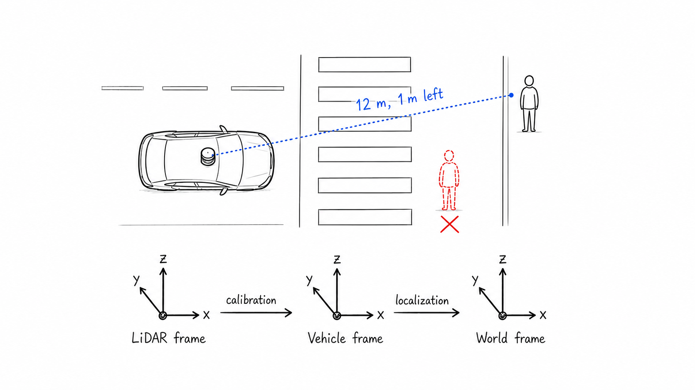
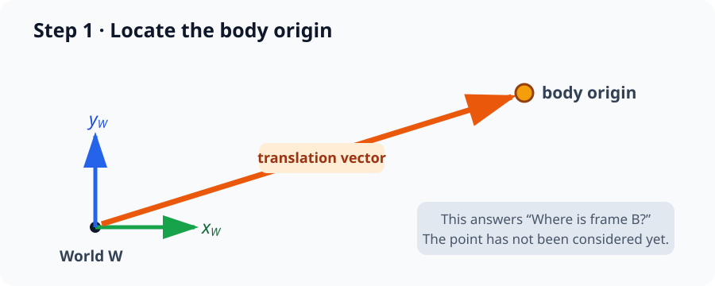
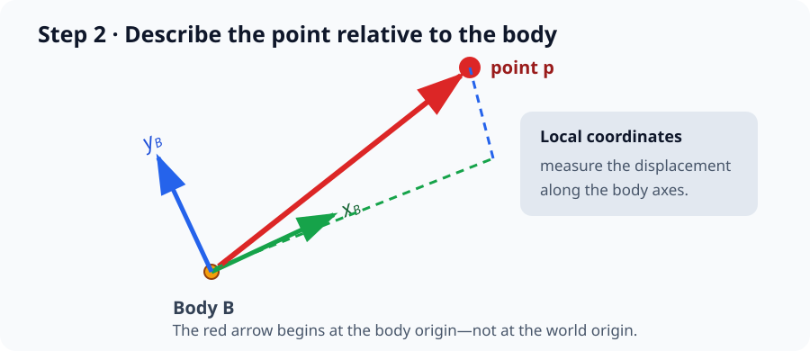
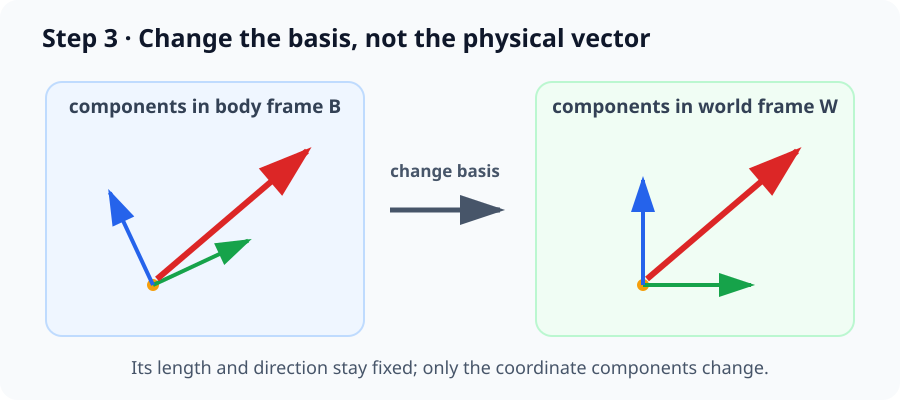
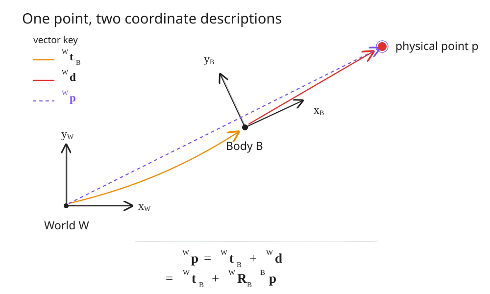
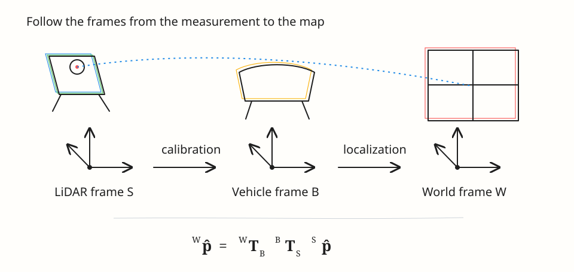
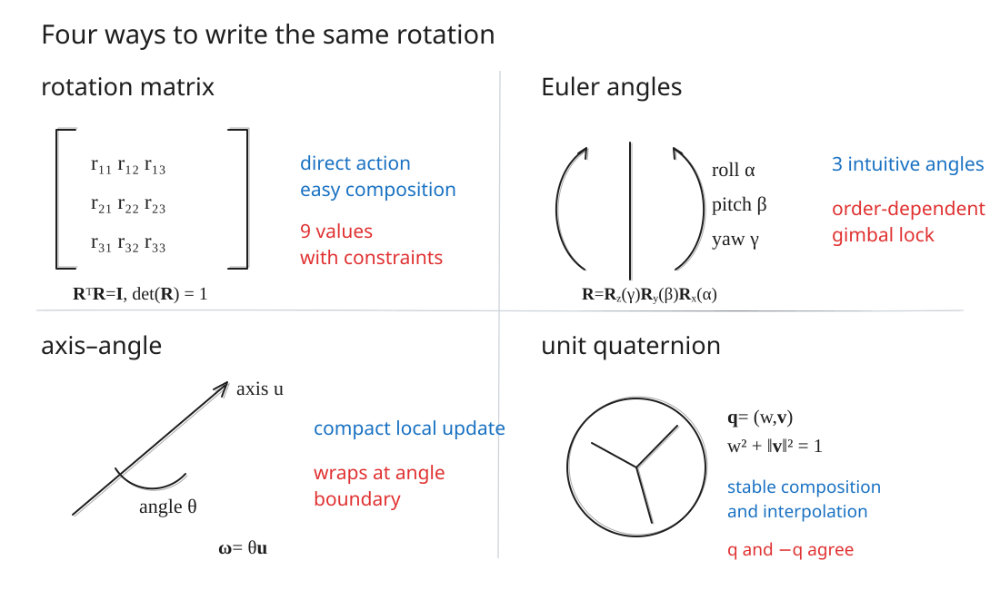
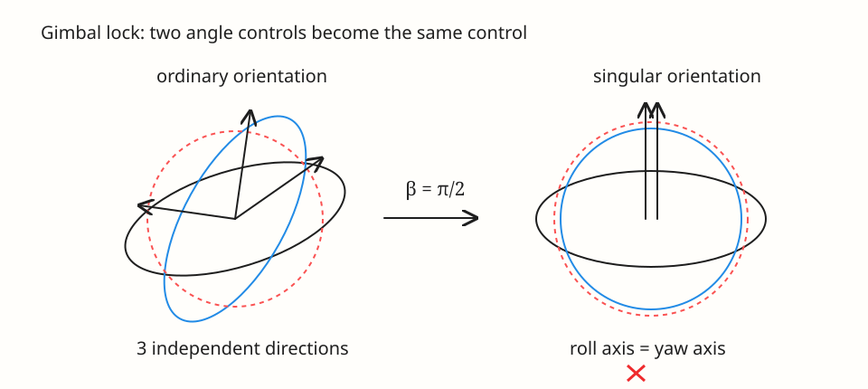

Imagine an autonomous car approaching a busy intersection at night. Its roof-mounted LiDAR catches a cluster of reflections and identifies a pedestrian: 12 meters forward, 1 meter to the left. A moment later, the motion planner must decide whether that person is entering the car's path. But there is a hidden problem. The LiDAR described the pedestrian relative to the **sensor**, while the planner reasons relative to the **vehicle**, and the navigation system tracks both of them on a **world map**.

The pedestrian has not moved, only the viewpoint has changed. To connect what the sensor sees with where the vehicle believes it is, we need to carry the measurement through a chain of coordinate frames. One link comes from calibration, which tells us how the LiDAR is mounted on the car. Another comes from localization, which tells us where the car is in the world. If either link is inverted or composed in the wrong order, a pedestrian on the sidewalk can appear in the road.


_The same pedestrian detection must travel from the LiDAR frame, through the vehicle frame, and into the world frame before the motion planner can use it._

This is why poses and transforms sit at the foundation of machine perception. In this note, we will build the geometry behind them from first principles: how a pose relates two frames, how a rigid transform rotates and translates coordinates, how several transforms compose, and why the choice of rotation representation matters in practice.


> [!note] The one sentence to remember
> A **pose** tells us where one coordinate frame is located and how it is rotated relative to another frame. A **transform** uses that position and rotation to convert a point's coordinates from one frame into the other.

---

## 1. Coordinate Frames and Poses

A coordinate frame consists of an origin and an ordered set of perpendicular axes. The same physical point has different coordinates in different frames. For example, a pedestrian may be at $(12,1,0)$ in a LiDAR frame but at $(37,-8,0)$ in a world frame. Neither vector is the pedestrian's absolute identity; each is a description relative to a chosen origin and basis.

A rigid body's **pose** combines:

- **position**: where the body-frame origin is located; and
- **orientation**: how the body-frame axes are aligned.

In three dimensions, a free rigid body has six degrees of freedom: three translations and three rotations. A pose is often represented computationally by a rotation matrix $\mathbf R\in\mathbb R^{3\times3}$ and a translation vector $\mathbf t\in\mathbb R^3$.

For intuition, we can collect the six pose parameters into

$$
\mathbf x
=
\begin{bmatrix}
t_x & t_y & t_z & \alpha & \beta & \gamma
\end{bmatrix}^{T},
$$

where $(t_x,t_y,t_z)$ locate the body-frame origin and $(\alpha,\beta,\gamma)$ denote roll, pitch, and yaw under a chosen Euler-angle convention.

### 1.1 A notation that prevents frame bugs

Before writing an equation, we need a way to say **which frame a quantity belongs to**. A left superscript names the frame in which coordinates are expressed. Thus,

$$
{}^{B}\mathbf p
$$

means “the coordinates of physical point $\mathbf p$ measured in frame $B$.” The point itself is not changing; the superscript only identifies the coordinate system used to describe it.

For a transform, we need both a source and a destination:

$$
{}^{A}\mathbf T_{B}.
$$

The superscript $A$ is the destination and the subscript $B$ is the source, so ${}^{A}\mathbf T_B$ means “map coordinates from frame $B$ into frame $A$.” We will construct this transform below and introduce its homogeneous matrix form in Section 3.

### 1.2 Building the transformation step by step

Consider a body frame $B$ placed somewhere inside the world frame $W$. We know a point through its body-frame coordinates ${}^{B}\mathbf p$, and we want its world-frame coordinates ${}^{W}\mathbf p$.

**Step 1: locate the body origin.** The translation

$$
{}^{W}\mathbf t_B
$$

is the vector from the world origin to the body origin, expressed using world coordinates. At this stage, we have located frame $B$, but not the point.


_Step 1: Translation places the body-frame origin relative to the world-frame origin._

**Step 2: describe the point relative to the body.** The vector ${}^{B}\mathbf p$ runs from the body origin to the point, but its components are measured along the body axes. Because the body axes are rotated relative to the world axes, we cannot add this vector directly to ${}^{W}\mathbf t_B$.


_Step 2: Body-frame coordinates describe the displacement from the body origin to the point._

**Step 3: rotate the local displacement into the world basis.** The rotation ${}^{W}\mathbf R_B$ converts components measured along the body axes into components measured along the world axes:

$$
{}^{W}\mathbf d
= {}^{W}\mathbf R_B\,{}^{B}\mathbf p.
$$

Here, ${}^{W}\mathbf d$ is the same geometric displacement from the body origin to the point, now written in world coordinates. Rotation changes its coordinate components but not its length.


_Step 3: Rotation changes the basis used to describe the displacement; it does not move or resize the vector._

**Step 4: add vectors that now share the same basis.** Both ${}^{W}\mathbf t_B$ and ${}^{W}\mathbf d$ are expressed in frame $W$, so they can be added:

$$
\begin{aligned}
{}^{W}\mathbf p
&= {}^{W}\mathbf t_B + {}^{W}\mathbf d \\
&= {}^{W}\mathbf t_B
 + {}^{W}\mathbf R_B\,{}^{B}\mathbf p.
\end{aligned}
$$

Figure 2 completes the construction by drawing the two world-basis component vectors head to tail. The orange vector reaches the body origin, the red vector continues to the point, and the dashed purple vector is their sum.



_Figure 2: A body-frame point becomes a world-frame point by rotating its local displacement into the world basis and adding the body origin's world-frame translation._

> [!warning] Pose versus point motion
> The same matrix can be described as moving a point or as changing the coordinate frame in which a fixed point is expressed. These active and passive interpretations lead to inverse transforms if mixed. Pick one convention, document it, and attach frame labels to every quantity.

---

## 2. Rigid Transforms

Suppose ${}^{B}\mathbf p$ is a point expressed in a body frame $B$. If the orientation of $B$ relative to world frame $W$ is ${}^{W}\mathbf R_B$ and the body origin is located at ${}^{W}\mathbf t_B$, then

$$
\boxed{
{}^{W}\mathbf p
= {}^{W}\mathbf R_B\,{}^{B}\mathbf p
+ {}^{W}\mathbf t_B
}
$$

The order matters:

1. ${}^{W}\mathbf R_B$ rewrites the point using the world-frame basis.
2. ${}^{W}\mathbf t_B$ shifts it from the body origin to the world origin.

Translation is added after rotation because both terms must already be expressed in the same frame before they can be added.

### 2.1 What makes the transform rigid?

A valid 3D rotation satisfies

$$
\mathbf R^T\mathbf R=\mathbf I,
\qquad
\det(\mathbf R)=1.
$$

Orthogonality gives $\mathbf R^{-1}=\mathbf R^T$. It also preserves distances. For two points $\mathbf a$ and $\mathbf b$,

$$
\begin{aligned}
\|\mathbf a'-\mathbf b'\|_2^2
&=\|\mathbf R(\mathbf a-\mathbf b)\|_2^2\\
&=(\mathbf a-\mathbf b)^T\mathbf R^T\mathbf R(\mathbf a-\mathbf b)\\
&=\|\mathbf a-\mathbf b\|_2^2.
\end{aligned}
$$

Translation disappears in the difference, and rotation preserves the remaining norm. Inner products - and therefore angles - are preserved for the same reason. The condition $\det(\mathbf R)=1$ rules out reflections, so handedness is preserved as well.

---

## 3. Homogeneous Coordinates

The expression $\mathbf R\mathbf p+\mathbf t$ is affine rather than linear because of the addition. Homogeneous coordinates absorb the translation into one matrix multiplication by appending an extra coordinate:

$$
{}^{W}\hat{\mathbf p}
=
\begin{bmatrix}
{}^{W}\mathbf p\\1
\end{bmatrix},
\qquad
{}^{W}\mathbf T_B
=
\begin{bmatrix}
{}^{W}\mathbf R_B & {}^{W}\mathbf t_B\\
\mathbf 0^T & 1
\end{bmatrix}.
$$

Then a rigid transform becomes

$$
\boxed{
{}^{W}\hat{\mathbf p}
= {}^{W}\mathbf T_B\,{}^{B}\hat{\mathbf p}
}
$$

This $4\times4$ matrix belongs to the special Euclidean group $SE(3)$. Although it stores 12 nontrivial numbers, it has only six degrees of freedom because the nine entries of $\mathbf R$ are constrained.

### 3.1 Points and directions are different

A point uses a final coordinate of $1$:

$$
\hat{\mathbf p}=\begin{bmatrix}\mathbf p\\1\end{bmatrix}.
$$

A direction uses a final coordinate of $0$:

$$
\hat{\mathbf v}=\begin{bmatrix}\mathbf v\\0\end{bmatrix}.
$$

Consequently,

$$
\begin{bmatrix}\mathbf R&\mathbf t\\\mathbf0^T&1\end{bmatrix}
\begin{bmatrix}\mathbf v\\0\end{bmatrix}
=
\begin{bmatrix}\mathbf R\mathbf v\\0\end{bmatrix}.
$$

Translation affects locations, not directions. This distinction matters for surface normals, velocities, rays, and axis vectors.

---

## 4. Inverting a Transform

If

$$
{}^{A}\mathbf T_B=
\begin{bmatrix}
\mathbf R&\mathbf t\\
\mathbf0^T&1
\end{bmatrix},
$$

then the reverse mapping is

$$
\boxed{
{}^{B}\mathbf T_A
=({}^{A}\mathbf T_B)^{-1}
=
\begin{bmatrix}
\mathbf R^T&-\mathbf R^T\mathbf t\\
\mathbf0^T&1
\end{bmatrix}
}
$$

The translation is **not** merely $-\mathbf t$. The vector must also be expressed in the inverse frame, which is why it becomes $-\mathbf R^T\mathbf t$.

We can verify the result directly:

$$
\begin{bmatrix}\mathbf R&\mathbf t\\\mathbf0^T&1\end{bmatrix}
\begin{bmatrix}\mathbf R^T&-\mathbf R^T\mathbf t\\\mathbf0^T&1\end{bmatrix}
=
\begin{bmatrix}\mathbf I&\mathbf0\\\mathbf0^T&1\end{bmatrix}.
$$

> [!tip] A reliable mental model
> To undo a transform, first undo the translation and then undo the rotation. Matrix multiplication writes those operations in reverse order, producing $\mathbf R^T(\mathbf p-\mathbf t)$.

---

## 5. Composing Coordinate Frames

An autonomous vehicle may contain a LiDAR frame $S$, a vehicle-body frame $B$, and a world frame $W$. Perception returns a pedestrian in the sensor frame, calibration provides the fixed sensor-to-body relationship, and localization estimates the changing body-to-world relationship.


_Figure 3: A sensor measurement reaches the world by following the available frame chain from right to left._

The desired world coordinate is

$$
\boxed{
{}^{W}\hat{\mathbf p}
= {}^{W}\mathbf T_B
  {}^{B}\mathbf T_S
  {}^{S}\hat{\mathbf p}
}
$$

The frame labels expose both the correct matrices and their order:

$$
{}^{W}\cancel{\mathbf T_{B}}
{}^{\cancel{B}}\mathbf T_S
{}^{S}\hat{\mathbf p}
\longrightarrow {}^{W}\hat{\mathbf p}.
$$

More explicitly, if the component transforms are $(\mathbf R_{WB},\mathbf t_{WB})$ and $(\mathbf R_{BS},\mathbf t_{BS})$, their composition is

$$
{}^{W}\mathbf T_S
= {}^{W}\mathbf T_B{}^{B}\mathbf T_S
=
\begin{bmatrix}
\mathbf R_{WB}\mathbf R_{BS}
&
\mathbf R_{WB}\mathbf t_{BS}+\mathbf t_{WB}\\
\mathbf0^T&1
\end{bmatrix}.
$$

Notice that the inner translation $\mathbf t_{BS}$ must be rotated before the outer translation is added. Transform multiplication is generally noncommutative:

$$
\mathbf T_1\mathbf T_2\neq\mathbf T_2\mathbf T_1.
$$

### 5.1 A numerical 2D example

Suppose a sensor is mounted one meter ahead of a vehicle's body origin:

$$
{}^{B}\mathbf t_S=\begin{bmatrix}1\\0\end{bmatrix},
\qquad {}^{B}\mathbf R_S=\mathbf I.
$$

The vehicle is at $(10,5)$ in the world and rotated $90^\circ$ counterclockwise:

$$
{}^{W}\mathbf R_B=
\begin{bmatrix}0&-1\\1&0\end{bmatrix},
\qquad
{}^{W}\mathbf t_B=\begin{bmatrix}10\\5\end{bmatrix}.
$$

A pedestrian detected two meters along the sensor's $x$-axis has ${}^{S}\mathbf p=[2,0]^T$. First map sensor to body:

$$
{}^{B}\mathbf p=\begin{bmatrix}3\\0\end{bmatrix}.
$$

Then map body to world:

$$
{}^{W}\mathbf p
=
\begin{bmatrix}0&-1\\1&0\end{bmatrix}
\begin{bmatrix}3\\0\end{bmatrix}
+
\begin{bmatrix}10\\5\end{bmatrix}
=
\begin{bmatrix}10\\8\end{bmatrix}.
$$

The local phrase "three meters ahead" becomes the world location $(10,8)$ because the vehicle's forward axis points along world $+y$.

---

## 6. Rotation Matrices and $SO(3)$

The set of valid 3D rotation matrices is

$$
SO(3)=\left\{\mathbf R\in\mathbb R^{3\times3}
\mid \mathbf R^T\mathbf R=\mathbf I,\ \det(\mathbf R)=1\right\}.
$$

The columns of $\mathbf R$ are the rotated coordinate axes expressed in the destination frame. They are orthonormal and right-handed. Rotation matrices are convenient because they act on vectors and compose through ordinary matrix multiplication, but nine stored values represent only three degrees of freedom. Numerical optimization can also push a matrix away from the $SO(3)$ constraints unless it is re-normalized.

No single rotation representation is best for every job.


_Figure 4: Rotation representations trade storage, interpretability, singularities, and ease of composition._

### 6.1 Euler angles

Euler angles describe orientation as three sequential elemental rotations. Under the roll-pitch-yaw convention used here,

$$
\mathbf R=\mathbf R_z(\gamma)\mathbf R_y(\beta)\mathbf R_x(\alpha),
$$

where $\alpha$, $\beta$, and $\gamma$ are roll, pitch, and yaw. The rightmost rotation is applied first.

Euler angles are compact and intuitive for human-facing interfaces, but the axis order is part of the definition. Changing the order changes the final orientation. They also have singular configurations. At pitch $\beta=\pi/2$, roll and yaw become coupled: two nominal degrees of freedom produce the same physical motion. This is **gimbal lock**.


_Figure 5: At the singular pitch, the roll and yaw axes align. The object can still rotate, but the chosen coordinates can no longer distinguish all three local directions of rotation._

> [!important] Gimbal lock is a coordinate singularity
> The physical orientation is valid; the Euler-angle chart is what becomes singular. Switching to a quaternion does not change the object - it changes the coordinates used to describe its orientation.

### 6.2 Axis-angle and the rotation vector

Any 3D rotation can be described by a unit axis $\mathbf u$ and an angle $\theta$. Define the skew-symmetric cross-product matrix

$$
[\mathbf u]_\times=
\begin{bmatrix}
0&-u_z&u_y\\
u_z&0&-u_x\\
-u_y&u_x&0
\end{bmatrix},
$$

so that $[\mathbf u]_\times\mathbf v=\mathbf u\times\mathbf v$. Rodrigues' formula converts axis-angle to a rotation matrix:

$$
\boxed{
\mathbf R
=\mathbf I
+\sin\theta[\mathbf u]_\times
+(1-\cos\theta)[\mathbf u]_\times^2
}
$$

The **rotation vector** $\boldsymbol\omega=\theta\mathbf u$ combines the axis and angle into three numbers. It is excellent for small updates in optimization and state estimation. However, the representation wraps at the boundary: $179^\circ$ and $-179^\circ$ look far apart numerically even though the rotations are only $2^\circ$ apart.

### 6.3 Unit quaternions

Using scalar-first convention, a unit quaternion is

$$
\mathbf q=(w,\mathbf v),
\qquad
w^2+\|\mathbf v\|^2=1.
$$

An axis-angle rotation maps to

$$
\boxed{
\mathbf q=
\left(
\cos\frac{\theta}{2},
\mathbf u\sin\frac{\theta}{2}
\right)
}
$$

Quaternions are compact, numerically stable, efficient to compose, and well suited to interpolation. Their main ambiguity is a double cover: $\mathbf q$ and $-\mathbf q$ encode the same physical rotation. A quaternion must also remain normalized.

For quaternions $\mathbf q_1=(w_1,\mathbf v_1)$ and $\mathbf q_2=(w_2,\mathbf v_2)$, composition uses the Hamilton product

$$
\mathbf q_1\otimes\mathbf q_2
=
\left(
w_1w_2-\mathbf v_1^T\mathbf v_2,
\;w_1\mathbf v_2+w_2\mathbf v_1+\mathbf v_1\times\mathbf v_2
\right).
$$

As with matrices, multiplication order matters.

### 6.4 Choosing a representation

| Representation | Stored values | Main advantage | Main caution |
|---|---:|---|---|
| Rotation matrix | 9 | Direct action and easy composition | Redundant; must remain orthogonal |
| Euler angles | 3 | Human-readable | Order-dependent; gimbal lock |
| Axis-angle | 4 | Geometrically meaningful | Sign and boundary ambiguities |
| Rotation vector | 3 | Convenient local optimization update | Discontinuous at the angle boundary |
| Unit quaternion | 4 | Stable composition and interpolation | Unit-norm constraint; $\mathbf q\equiv-\mathbf q$ |

A common engineering pattern is to use quaternions or rotation matrices for stored poses, rotation vectors for optimizer updates, and Euler angles only for display.

---

## 7. Implementation Pattern

The following NumPy functions encode the same frame convention used throughout this note:

```python
import numpy as np


def make_transform(R: np.ndarray, t: np.ndarray) -> np.ndarray:
    """Construct destination_T_source from destination_R_source and destination_t_source."""
    T = np.eye(4)
    T[:3, :3] = R
    T[:3, 3] = t
    return T


def invert_transform(A_T_B: np.ndarray) -> np.ndarray:
    """Return B_T_A."""
    R = A_T_B[:3, :3]
    t = A_T_B[:3, 3]

    B_T_A = np.eye(4)
    B_T_A[:3, :3] = R.T
    B_T_A[:3, 3] = -R.T @ t
    return B_T_A


def transform_point(A_T_B: np.ndarray, B_p: np.ndarray) -> np.ndarray:
    """Map a 3D point from frame B to frame A."""
    B_p_h = np.append(B_p, 1.0)
    return (A_T_B @ B_p_h)[:3]


def is_rotation_matrix(R: np.ndarray, atol: float = 1e-7) -> bool:
    return (
        np.allclose(R.T @ R, np.eye(3), atol=atol)
        and np.isclose(np.linalg.det(R), 1.0, atol=atol)
    )
```

For a sensor-to-world chain, write the code in the same order as the mathematics:

```python
W_T_S = W_T_B @ B_T_S
W_p = transform_point(W_T_S, S_p)
```

Good tests should verify:

```python
assert np.allclose(A_T_B @ invert_transform(A_T_B), np.eye(4))
assert is_rotation_matrix(A_T_B[:3, :3])

# A rigid transform preserves pairwise distances.
assert np.isclose(
    np.linalg.norm(transform_point(A_T_B, B_p1) - transform_point(A_T_B, B_p2)),
    np.linalg.norm(B_p1 - B_p2),
)
```

> [!warning] Library conventions differ
> Before combining libraries, check axis handedness, quaternion component order (`wxyz` versus `xyzw`), angle units, Euler order, whether vectors are rows or columns, and whether a matrix maps source-to-destination or destination-to-source. Shape compatibility alone does not prove semantic compatibility.

---

## 8. Summary

The geometry of machine perception rests on a small set of reusable ideas:

1. Coordinates are meaningless without a frame.
2. A pose relates two frames through orientation and position.
3. A rigid transform maps source-frame coordinates into a destination frame.
4. Homogeneous coordinates unify rotation and translation.
5. Transform labels determine composition order; matching inner frames should cancel.
6. Inversion uses $\mathbf R^T$ and $-\mathbf R^T\mathbf t$, not a simple matrix transpose.
7. Rotation matrices, Euler angles, axis-angle vectors, and quaternions describe the same geometry with different tradeoffs.

Once the notation is disciplined, a complicated multi-sensor system becomes a graph of frames connected by transforms. Perception supplies measurements, calibration connects sensors to the platform, and localization connects the platform to the world.

---

## References

- Wang, S. (2026). *CS 498 Fall 2026, Lecture 2: Poses, Coordinates, Transforms and Rotations*. University of Illinois Urbana-Champaign, August 28, 2026.
- [3D Rotations - Robotic Systems](http://motion.cs.illinois.edu/RoboticSystems/3DRotations.html).
- [Visualizing Quaternions](https://eater.net/quaternions/).
