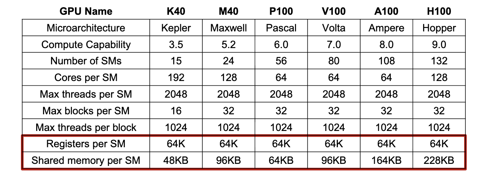

Building on our [naive matrix multiplication implementation](matmul), we'll now explore **tiled matrix multiplication** - a crucial optimization technique that dramatically improves performance by leveraging the GPU's memory hierarchy. This approach addresses the memory bandwidth limitations we discussed in our [CUDA memory model](cuda_mem) post.

> [!note] Why Tiling Matters
> The naive approach suffers from poor **compute-to-memory access ratio** (arithmetic intensity). Each element is loaded multiple times from global memory, making the kernel memory-bound. Tiling solves this by reusing data in fast on-chip memories.

## The Problem with Naive Matrix Multiplication

Our previous [naive implementation](matmul) has a fundamental limitation: each element of matrices A and B is loaded from global memory multiple times. For a matrix multiplication C = A × B:

- Each element of A is loaded **n times** (once for each column of B)
- Each element of B is loaded **m times** (once for each row of A)
- This results in very low arithmetic intensity: **0.25 FLOP/B**


## The Tiling Strategy

Tiling divides the computation into smaller **tiles** that fit in fast on-chip memory (shared memory). The key insight is:

1. **Load tiles** of A and B into shared memory
2. **Compute partial results** using the tiles
3. **Reuse the loaded data** for multiple computations
4. **Accumulate results** in registers

### Mathematical Foundation

For matrices A (M×K), B (K×N), and C (M×N), we partition them into tiles:

- A is divided into tiles of size TILE_SIZE × TILE_SIZE
- B is divided into tiles of size TILE_SIZE × TILE_SIZE  
- C is computed tile by tile

Each tile of C is computed as:
$$C_{tile} = \sum_{k=0}^{K/TILE\_SIZE} A_{tile,k} \times B_{tile,k}$$

## CUDA Implementation

### Kernel Design

```c++
__global__ void tiledMatMul(float* A, float* B, float* C, int M, int N, int K) {
    // Allowcate Shared memory for tiles
    
    
    // Iterate over tiles
    for (int tile = 0; tile < (K + TILE_SIZE - 1) / TILE_SIZE; tile++) {
        // Load tile of A into shared memory
        
        // Load tile of B into shared memory
        
        // Synchronize to ensure all threads have loaded their data
        __syncthreads();
        
        // Compute partial result using shared memory
        }
        
        // Synchronize before loading next tile
        __syncthreads();
    }
    
    // Write result to global memory
}
```

### Thread Block Configuration

```c++
// Launch configuration
dim3 blockSize(TILE_SIZE, TILE_SIZE);  // 16x16 = 256 threads per block
dim3 gridSize((N + TILE_SIZE - 1) / TILE_SIZE, 
              (M + TILE_SIZE - 1) / TILE_SIZE);

tiledMatMul<<<gridSize, blockSize>>>(A, B, C, M, N, K);
```

## Handling Out-of-Bounds Matrix Access

When matrices don't divide evenly by the tile size, we need to handle boundary conditions carefully. Let's examine a concrete example:

> [!example] Out-of-Bounds Example
> 
> **Matrix dimensions**: A(1000×800), B(800×1200), C(1000×1200)
> **Tile size**: 16×16
> 
> **Grid configuration**:
> - Grid X: (1200 + 16 - 1) / 16 = 75 blocks
> - Grid Y: (1000 + 16 - 1) / 16 = 63 blocks
> - Total: 75 × 63 = 4,725 blocks
> 
> **Boundary cases**:
> - **Rightmost tiles**: Columns 1184-1199 (partial tile)
> - **Bottom tiles**: Rows 992-999 (partial tile)
> - **Last tile in K dimension**: K=800, tile covers 784-799

### Boundary Condition Analysis

```c++
// Example: Thread at (tx=8, ty=12) in block (bx=74, by=62)
int row = by * TILE_SIZE + ty;  // 62*16 + 12 = 1004
int col = bx * TILE_SIZE + tx;  // 74*16 + 8 = 1192

// For matrix A (1000×800):
if (row < M && (tile * TILE_SIZE + tx) < K) {
    // row = 1004 >= 1000 → FALSE, so As[ty][tx] = 0.0f
    As[ty][tx] = A[row * K + tile * TILE_SIZE + tx];
} else {
    As[ty][tx] = 0.0f;  // ← This executes
}

// For matrix B (800×1200):
if ((tile * TILE_SIZE + ty) < K && col < N) {
    // col = 1192 < 1200 → TRUE, but depends on tile
    Bs[ty][tx] = B[(tile * TILE_SIZE + ty) * N + col];
} else {
    Bs[ty][tx] = 0.0f;  // ← May execute for last tile
}
```


### Why Zero Padding Works

> [!tip] Zero Padding Strategy
> 
> Setting out-of-bounds elements to 0.0f is safe because:
> - **Multiplication by zero**: 0 × anything = 0
> - **Addition of zero**: sum + 0 = sum (no effect)
> - **Preserves correctness**: Final result is unchanged
> 
> **Alternative approaches**:
> - Skip computation for out-of-bounds threads
> - Use separate kernels for boundary tiles
> - Pad matrices to tile-aligned dimensions

### Complete Kernel With Boundary Handling

```c++
__global__ void tiledMatMulSafe(float* A, float* B, float* C, int M, int N, int K) {
    __shared__ float As[TILE_SIZE][TILE_SIZE];
    __shared__ float Bs[TILE_SIZE][TILE_SIZE];
    
    int tx = threadIdx.x;
    int ty = threadIdx.y;
    int bx = blockIdx.x;
    int by = blockIdx.y;
    
    int row = by * TILE_SIZE + ty;
    int col = bx * TILE_SIZE + tx;
    
    float sum = 0.0f;
    
    for (int tile = 0; tile < (K + TILE_SIZE - 1) / TILE_SIZE; tile++) {
        // Load A tile with bounds checking
        int A_col = tile * TILE_SIZE + tx;
        if (row < M && A_col < K) {
            As[ty][tx] = A[row * K + A_col];
        } else {
            As[ty][tx] = 0.0f;
        }
        
        // Load B tile with bounds checking  
        int B_row = tile * TILE_SIZE + ty;
        if (B_row < K && col < N) {
            Bs[ty][tx] = B[B_row * N + col];
        } else {
            Bs[ty][tx] = 0.0f;
        }
        
        __syncthreads();
        
        // Compute with bounds checking
        for (int k = 0; k < TILE_SIZE; k++) {
            int A_k = tile * TILE_SIZE + k;
            if (A_k < K) {  // Only multiply if within bounds
                sum += As[ty][k] * Bs[k][tx];
            }
        }
        
        __syncthreads();
    }
    
    // Write result with bounds checking
    if (row < M && col < N) {
        C[row * N + col] = sum;
    }
}
```


## Memory Hierarchy Utilization

> [!tip] Memory Usage Breakdown
> - **Global memory**: Initial tile loads (coalesced access)
> - **Shared memory**: Tile storage and reuse (fast on-chip access)
> - **Registers**: Accumulation variable `sum` (fastest access)
> - **Constant memory**: Could store TILE_SIZE if needed


## Comparison with Naive Implementation
Let assume that, we use kernel with tile size $T \times T$ and $M,N,K$ can be divided by $T$

| Aspect | Naive | Tiled |
|--------|-------|-------|
| **Shared Memory** | Not used | $T\times T$ |
| **Performance** | Memory-bound | Near compute-bound |
| **Code Complexity** | Simple | Moderate |
| **Arithmetic Intensity** | 0.25 FLOP/B | 16+ FLOP/B |
| **Memory Traffic** | $2\times M\times N\times K$ | $(M\times K)\times (N/T)  + (K \times N)\times(M/T) $ |


In general compare to naive implementation the memory traffic is reduced by a factor of $T$ and [branch divergence](cuda_scheduling) affects only blocks on boundaries, and should be small for large matrices.


> [!example]- Memory Access Analysis
> 
> Assume that the following matrix size specifications are passed to your tiled matrix multiplication kernel in MP3:
> numARows=55
> numAColumns=48
> numBRows=48
> numBColumns=43
> numCRows=55
> numCColumns=43
> Remember that the matrices contain floats.
> 
> Also assume that you are using 
>  $16\times 16$ tiles.
> 
>> [!example]- How many Bytes are read from global memory by the kernel?
>> Answer: 64704
>
>> [!example]- How many Bytes are written to global memory by the kernel?
>> Answer:  9460
>


> [!example]- Tiled Matrix Multiplication Computation Use
> 
> Assume that the following matrix size specifications are passed to your tiled matrix multiplication kernel in MP3:
> numARows=142
> numAColumns=110
> numBRows=110
> numBColumns=146
> numCRows=142
> numCColumns=146
> Remember that the matrices contain floats.
> 
> Also assume that you are using 
> $32\times 32$ tiles.
> 
> Recall that floating-point arithmetic operations include mathematical operations such as addition and multiplication.
> 
>> [!example]-  Consider a matrix multiplication implementation where only threads responsible for an element in the output matrix C are required to perform floating-point operations. How many floating-point operations are executed in this implementation with respect to the parameters above?
>> solution: 4561040 
>
>> [!example]-  Now consider an implementation where all threads launched perform floating-point operations. How many floating-point operations are executed now?
>> solution: 6553600
>


## Hardware Constraints to Consider

- **Registers per SM**: 64K(32-bit registers)
- **Shared Memory per SM**: 48KB-164KB
- **Threads per SM**: 1024-2048 concurrent threads


<figure>
  
  <figcaption>Register usage per thread, and shared memory usage per thread block constrain occupancy</figcaption>
</figure>

| Tile Size | Shared Memory | Use Case |
|-----------|---------------|----------|
| **32×32** | 8KB | Conservative, works on most GPUs |
| **64×64** | 32KB | High-end GPUs, good performance |
| **128×128** | 128KB | Modern GPUs with large shared memory |

Selection Strategy
1. **Start conservative** with 32×32
2. **Profile different sizes** on target hardware
3. **Check occupancy** (aim for >50%)
4. **Monitor for register spilling**
5. **Measure actual performance**

>[!tip] Quick Decision Tree
>
> - If (GPU is modern Volta/Ampere) -> Try 64×64 or 128×128
> - Else if (GPU is Pascal or older) ->     Use 32×32
> - Always  Validate with profiling
> 
I will try to cover ways to calculate tile size for maximum occupancy in a future blog post.

## Key Takeaway

**Empirical testing beats theoretical calculation** - compiler optimizations and memory patterns significantly impact actual resource usage.

## When to Use Tiling

> [!note] Tiling is most beneficial when:
> - Matrices are large enough to benefit from data reuse
> - Memory bandwidth is the bottleneck (not compute)
> - You have sufficient shared memory per block
> - The algorithm has regular access patterns

## Best Practices

> [!tip] Implementation Guidelines
> 1. **Choose appropriate tile size**: Balance shared memory usage vs occupancy
> 4. **Use appropriate synchronization**: `__syncthreads()` at the right points
> 5. **Handle boundary conditions**: Check array bounds for partial tiles

## Summary

Tiled matrix multiplication demonstrates the power of understanding GPU memory hierarchy. By strategically using shared memory to reuse data, we can:

- **Increase arithmetic intensity** and **Reduce memory traffic** by a factor of $TILE_SIZE$ 
- **Achieve near-peak performance** on modern GPUs
- **Transform memory-bound kernels** into compute-bound ones
The key insight is that **data reuse** is often more valuable than raw computational power. This principle applies to many other GPU algorithms beyond matrix multiplication.

---
## References
Hwu, W.-M. W., Kirk, D. B., & El Hajj, I. (2022). Programming massively parallel processors (4th ed.). doi:10.1016/c2020-0-02969-5